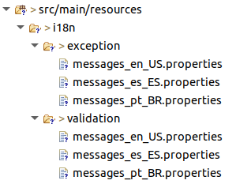

# Exemplo de uso do componente API Core (Validações e Exceções)

Exemplo para criação de validações e exceções utilizando o modulo **API Core**.

## Contexto

Para exemplificar a criação de validações e exceções com o uso da biblioteca **API Core**, faremos a criação de uma nave que possuirá validações para sua construção.

## Começando

Para criação deste exemplo vamos iniciar a explicação a partir de um projeto Spring já criado, caso você não possua um projeto criado basta acessar o [Spring initializr](https://start.spring.io/) e criar o projeto. Na geração da aplicação adicione como dependência as bibliotecas **Spring WEB** e o **Lombok**.

## Dependências

Além das dependências do Spring mencionadas acima, para utilização do componente é necessário alterar o `parent` da aplicação no arquivo `pom.xml`:

```xml
<parent>
  <groupId>com.totvs.tjf</groupId>
  <artifactId>tjf-boot-starter</artifactId>
  <version>2.6.0-RELEASE</version>
  <relativePath />
</parent>
```

E incluir as dependências abaixo:

```xml
<!-- TJF -->
<dependency>
  <groupId>com.totvs.tjf</groupId>
  <artifactId>tjf-api-core</artifactId>
</dependency>

<dependency>
  <groupId>com.totvs.tjf</groupId>
  <artifactId>tjf-core-validation</artifactId>
</dependency>
```

Vamos adicionar também o repositório Maven de _release_ do TJF:

```xml
<repositories>
  <repository>
    <id>central-release</id>
    <name>TOTVS Java Framework: Releases</name>
    <url>http://maven.engpro.totvs.com.br/artifactory/libs-release/</url>
  </repository>
</repositories>
```

## Codificando

Agora vamos codificar um pouco, iniciando com a criação da classe `Starship` que será nosso modelo para criação de uma nova nave, nela iremos inserir as validações, conforme documentação do módulo **API Core**:

```java
@Getter
@Setter
@NoArgsConstructor
public class Starship {

  @NotBlank(message = "{Starship.name.NotBlank}")
  private String name;

  @NotBlank(message = "{Starship.description.NotBlank}")
  @Size(min = 1, max = 15, message = "{Starship.description.Size}")
  private String description;

  @Max(value = 5, message = "{Startshp.crew.Max}")
  private int crew;

}
```

> Repare que cada variável declarada possui uma anotação, está anotação serve para validação e é composta por uma mensagem, que iremos criar ao decorrer do exemplo.

Após a criação do modelo, vamos criar a nossa exceção que usaremos durante a validação da nave:

```java
@ApiBadRequest("StarshipCreateConstraintException")
public class StarshipCreateConstraintException extends ConstraintViolationException {

  private static final long serialVersionUID = 1L;

  public StarshipCreateConstraintException(Set<? extends ConstraintViolation<?>> constraintViolations) {
    super(constraintViolations);
  }

}
```

> Na anotação `@ApiBadRequest` foi inserido um valor que será responsável pela mensagem de exceção, a estrutura interna da exceção segue a documentação do módulo **API Core**.

Nesta etapa já temos tudo o que precisamos para validar um objeto e lançar uma exceção customizada, agora para deixarmos o exemplo mais dinâmico, criaremos uma API REST para criação das naves:

```java
@RestController
@RequestMapping(path = StarshipController.PATH, produces = APPLICATION_JSON_VALUE)
@ApiGuideline(ApiGuidelineVersion.V2)
public class StarshipController {

  public static final String PATH = "api/v1/starship";

  @Autowired
  private ValidatorService validator;

  @PostMapping(path = "/create")
  @ResponseStatus(code = HttpStatus.CREATED)
  public String createStarship(@RequestBody Starship dto) {
    validator.validate(dto).ifPresent(violations -> {
      throw new StarshipCreateConstraintException(violations);
    });
    return "{\"starship\":\"created\"}";
  }

}
```

A mágica acontece dentro do método `createStarship` que possui a validação dos objetos que dispara nossa exceção criada anteriormente.

Agora antes de testarmos, precisamos criar as mensagens de validação e exceção das classes `Starship` e `StarshipCreateConstraintException`. Para isso crie a seguinte estrutura de mensagens.

Lembre-se que conforme a documentação do módulo **i18n Core** as mensagens devem seguir o padrão de caracteres _unicode_.



Acesse o arquivo `i18n.exception.messages_pt_BR.properties` e crie as seguintes mensagens (não esqueça de traduzi-las):

```properties
StarshipCreateConstraintException.message = \u00c9 uma armadilha
StarshipCreateConstraintException.detail = A for\u00e7a n\u00e3o est\u00e1 com voc\u00ea
```

Para finalizar criaremos as mensagens de validação, para isso acesse o arquivo `i18n.validation.messages_pt_BR.properties` e crie as seguintes mensagens (que também precisam ser traduzidas):

```properties
Starship.name.NotBlank = O nome da nave n\u00e3o pode ser nulo
Starship.description.NotBlank = A descri\u00e7\u00e3o da nave n\u00e3o pode ser nula
Starship.description.Size = A descri\u00e7\u00e3o da nave n\u00e3o deve ser menor que {min} ou maior que {max}
Startshp.crew.Max = O n\u00famero de passageiros n\u00e3o deve ser superior a {value}
```

## Vamos testar?

Para testar tudo o que fizemos basta criar chamadas do método `POST` para a url `http://localhost:8080/api/v1/starship/create` com a seguinte estrutura:

```http
POST /api/v1/starship/create HTTP/1.1
Host: localhost:8080
Content-Type: application/json

{
  "name": "Millenium Falcon",
  "description": "Nave do Han",
  "crew": 5
}
```

Com essa requisição teremos o seguinte retorno:

```json
{
  "starship": "created"
}
```

Mas queremos testar e ver um erro de validação e não um sucesso. Para isso faça a seguinte requisição:

```http
POST /api/v1/starship/create HTTP/1.1
Host: localhost:8080
Content-Type: application/json

{
  "name": "Millenium Falcon",
  "description": "A sucata mais veloz da galáxia",
  "crew": 5
}
```

E teremos nosso retorno de erro:

```Json
{
  "code": "StarshipCreateConstraintException",
  "message": "É uma armadilha",
  "detailedMessage": "A força não está com você",
  "details": [
    {
      "code": "Starship.description.Size",
      "message": "A descrição da nave não deve ser menor que 1 ou maior que 15",
      "detailedMessage": "description: A sucata mais veloz da galáxia"
    }
  ]
}
```

> Observe que neste retorno existe a mensagem de exceção e a mensagem de validação.

## Que a força esteja com você!

Com isso terminamos nosso exemplo, fique a vontade para incrementar o exemplo utilizando todos os recursos proposto pelo componente **API Core**, caso necessário utilize nossa [documentação](https://tjf.totvs.com.br/wiki/tjf-api-core) e fique a vontade para mandar sugestões e melhorias para o projeto [TJF](https://tjf.totvs.com.br/).
