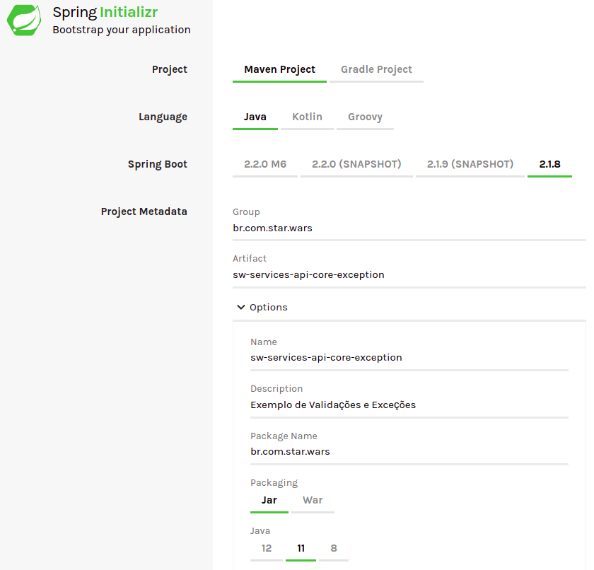
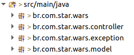

# API Core Validações e Exceções

Exemplo para criação de validações e exceções utilizando o modulo **tjf-api-core**.

## Contexto

Para exemplificar a criação de validações e exceções utilizando o **TJF**, faremos a criação de uma nave, que possuirá validações para sua construção.

:exclamation: **ALERTA DE SPOILER** :exclamation:

Teremos como resultado violações tratadas com o seguinte formato.

```Json
{
    "code": "StarshipCreateConstraintException",
    "message": "É uma armadilha",
    "detailedMessage": "A força não está com você",
    "details": [
        {
            "code": "Starship.description.Size",
            "message": "A descrição da nave não deve ser menor que 1 ou maior que 15",
            "detailedMessage": "description: A sucata mais veloz da galáxia"
        }
    ]
}
```

## Começar nós vamos

Iniciaremos o desenvolvimento criando um novo projeto [Spring](https://spring.io/) utilizando o serviço [Spring Initializr](https://start.spring.io/). O projeto deve possuir as configurações conforme abaixo:



## Configurações

Após gerado, precisamos realizar pequenas alterações e inserir algumas dependências do **TJF** no arquivo `pom.xml`.

1. Altere o projeto *parent* para o seguinte:

```xml
<parent>
	<groupId>com.totvs.tjf</groupId>
	<artifactId>tjf-boot-starter</artifactId>
	<version>1.11.0-RELEASE</version>
	<relativePath />
</parent>
```

2. Adicione as seguintes dependências do TJF:

```xml
<!-- TJF -->
<dependency>
	<groupId>com.totvs.tjf</groupId>
	<artifactId>tjf-api-core</artifactId>
</dependency>

<dependency>
	<groupId>com.totvs.tjf</groupId>
	<artifactId>tjf-core-validation</artifactId>
</dependency>
```

3. Adicione o repositório de RELEASE do TJF:

```xml
<repositories>
	<repository>
		<id>tjf-release</id>
		<name>TOTVS Java Framework: Releases</name>
		<url>http://maven.engpro.totvs.com.br/artifactory/libs-release/</url>
	</repository>
</repositories>
```

## Codificar nós devemos

Durante este exemplo criaremos uma classe de modelo que representará a nave, uma classe de exceção customizada e um controller para receber chamadas *POST*.

Com isso precisaremos da seguinte estrutura de pacotes:



Agora vamos codificar um pouco. Dentro do pacote `br.com.star.wars.model` crie a classe `Starship`, ele será nosso modelo para criação de uma nova nave, nela iremos inserir as validações, conforme documentação do modulo [tjf-api-core](https://tjf.totvs.com.br/wiki/tjf-api-core). Para isso basta inserir o seguinte fonte:

```Java
package br.com.star.wars.model;

import javax.validation.constraints.Max;
import javax.validation.constraints.NotBlank;
import javax.validation.constraints.Size;

public class Starship {

	@NotBlank(message = "{Starship.name.NotBlank}")
	private String name;

	@NotBlank(message = "{Starship.description.NotBlank}")
	@Size(min = 1, max = 15, message = "{Starship.description.Size}")
	private String description;

	@Max(value = 5, message = "{Startshp.crew.Max}")
	private int crew;

	// Getters and Setters
}
```

Repare que cada variável declarada possui uma anotação, está anotação serve para validação e é composta por uma mensagem, que iremos criar ao decorrer do exemplo. 
> Para melhor entendimento das anotações leia a documentação do modulo [tjf-api-core](https://tjf.totvs.com.br/wiki/tjf-api-core).

Após a criação do model, vamos criar a nossa exceção que usaremos durante a validação da nave.

Para isso dentro do pacote `br.com.star.wars.exception` crie a classe `StarshipCreateConstraintException`, nela teremos nossa exceção customizada, criada da seguinte maneira.

```Java
package br.com.star.wars.exception;

import java.util.Set;
import javax.validation.ConstraintViolation;
import javax.validation.ConstraintViolationException;
import com.totvs.tjf.api.context.stereotype.error.ApiBadRequest;

@ApiBadRequest("StarshipCreateConstraintException")
public class StarshipCreateConstraintException extends ConstraintViolationException {

	private static final long serialVersionUID = 1L;

	public StarshipCreateConstraintException(Set<? extends ConstraintViolation<?>> constraintViolations) {
		super(constraintViolations);
	}
}
```

Observe que na anotação `@ApiBadRequest` foi inserido um valor, que será responsável pela mensagem de exceção, a estrutura interna da exceção segue a documentação do modulo [tjf-api-core](https://tjf.totvs.com.br/wiki/tjf-api-core).

Nesta etapa já temos tudo o que precisamos para validar um objeto e lançar uma exceção customizada, agora para deixarmos o exemplo mais dinâmico, criaremos um controller para criação de uma nave. Para isso dentro do pacote `br.com.star.wars.controller` crie a classe `StarshipController`, ela será a responsável para criação do objeto `Starship`.

> Dica Importante: Visando agilizar o desenvolvimento Java, o TJF disponibilizou templates prontos, caso tenha interesse acesse a documentação [tjf-templates](https://tjf.totvs.com.br/docs/tjf-templates).

No nosso controller teremos o seguinte código:

```Java
package br.com.star.wars.controller;

import static org.springframework.http.MediaType.APPLICATION_JSON_VALUE;

import org.springframework.beans.factory.annotation.Autowired;
import org.springframework.http.HttpStatus;
import org.springframework.web.bind.annotation.PostMapping;
import org.springframework.web.bind.annotation.RequestBody;
import org.springframework.web.bind.annotation.RequestMapping;
import org.springframework.web.bind.annotation.ResponseStatus;
import org.springframework.web.bind.annotation.RestController;
import com.totvs.tjf.api.context.stereotype.ApiGuideline;
import com.totvs.tjf.api.context.stereotype.ApiGuideline.ApiGuidelineVersion;
import com.totvs.tjf.core.validation.ValidatorService;
import br.com.star.wars.exception.StarshipCreateConstraintException;
import br.com.star.wars.model.Starship;

@RestController
@RequestMapping(path = StarshipController.PATH, produces = APPLICATION_JSON_VALUE)
@ApiGuideline(ApiGuidelineVersion.v1)
public class StarshipController {

	public static final String PATH = "api/v1/starship";

	@Autowired
	private ValidatorService validator;

	@PostMapping(path = "/create")
	@ResponseStatus(code = HttpStatus.CREATED)
	public String createStarship(@RequestBody Starship dto) {

		validator.validate(dto).ifPresent(violations -> {
			throw new StarshipCreateConstraintException(violations);
		});

		return "{\n" + "	\"starship\": \"created\"\n" + "}";
	}
}
```

A mágica acontece dentro do método `createStarship` que possui a validação dos objetos que dispara nossa exceção criada anteriormente.

Agora antes de testarmos, precisamos criar as mensagens de validação e exceção das classes `Starship` e  `StarshipCreateConstraintException`. Para isso crie a seguinte estrutura de mensagens, conforme a documentação do modulo [tjf-api-core](https://tjf.totvs.com.br/wiki/tjf-api-core). Lembre-se que conforme a documentação do modulo [tjf-i18n-core](https://tjf.totvs.com.br/wiki/tjf-i18n-core) as mensagens deve seguir o padrão de caracteres *unicode*.


Agora acesse o arquivo `i18n.exception.messages_pt_BR.properties` e crie as seguintes mensagens. Não esqueça de traduzir suas mensagens.

```properties
StarshipCreateConstraintException.message = \u00c9 uma armadilha
StarshipCreateConstraintException.detail = A for\u00e7a n\u00e3o est\u00e1 com voc\u00ea
```

E para finalizar criaremos as mensagens de validação, para isso acesse o arquivo `i18n.validation.messages_pt_BR.properties` e crie as seguintes mensagens. Lembre-se de traduzi-las.

```properties
Starship.name.NotBlank = O nome da nave n\u00e3o pode ser nulo
Starship.description.NotBlank = A descri\u00e7\u00e3o da nave n\u00e3o pode ser nula
Starship.description.Size = A descri\u00e7\u00e3o da nave n\u00e3o deve ser menor que {min} ou maior que {max}
Startshp.crew.Max = O n\u00famero de passageiros n\u00e3o deve ser superior a {value}
```

## Testar agora nós podemos

Para testar tudo o que fizemos é muito simples, basta criar chamadas do método *POST* para a url `localhost:8080/api/v1/starship/create` com a seguinte estrutura. 

```http
POST /api/v1/starship/create HTTP/1.1
Host: localhost:8080
Content-Type: application/json

{
    "name": "Millenium Falcon",
    "description": "Nave do Han",
    "crew": 5
}
```

Com essa requisição teremos o seguinte retorno:

```Json
{
    "starship": "created"
}
```

Mas queremos ver um erro e não um sucesso, para isso faça a seguinte requisição.

```http
POST /api/v1/starship/create HTTP/1.1
Host: localhost:8080
Content-Type: application/json

{
    "name": "Millenium Falcon",
    "description": "A sucata mais veloz da galáxia",
    "crew": 5
}
```

E teremos nosso retorno de erro.

```Json
{
    "code": "StarshipCreateConstraintException",
    "message": "É uma armadilha",
    "detailedMessage": "A força não está com você",
    "details": [
        {
            "code": "Starship.description.Size",
            "message": "A descrição da nave não deve ser menor que 1 ou maior que 15",
            "detailedMessage": "description: A sucata mais veloz da galáxia"
        }
    ]
}
```

Observe que neste retorno existe a mensagem de exceção e a mensagem de validação.

## Isso é tudo pessoal!

Com isso terminamos nosso exemplo, fique a vontade para criar novas requisições e validar todas mensagens criadas. Caso sentiu falta de algo em nosso exemplo, faça um pull request para o mesmo, que iremos avaliar e disponibilizar o mesmo para todos. Não esqueça de acessar nosso [portal](https://tjf.totvs.com.br/home) para seguir as documentações.

> May the force be with you.