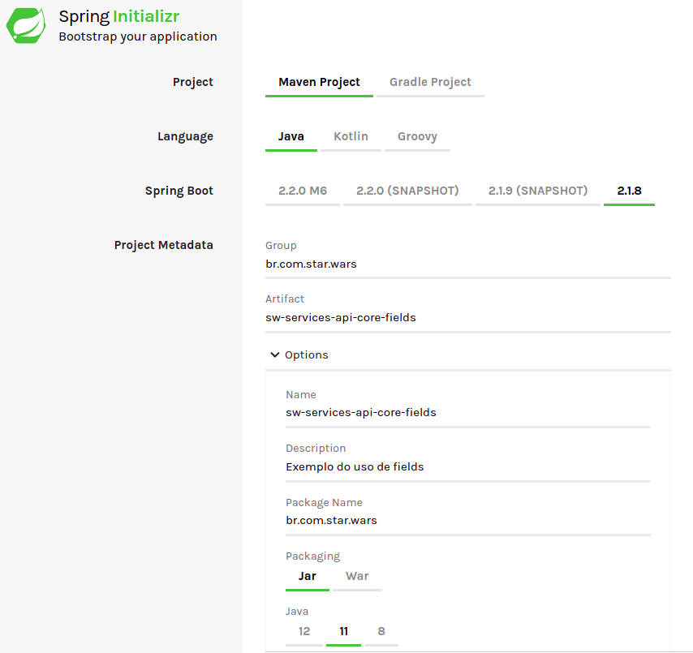

# API Core Fields

Exemplo para utilização dos *fields* com o modulo **tjf-api-core**.

## Contexto

Para exemplificar o uso de fields utilizando o **TJF**, faremos um exemplo de busca de Jedis, onde filtraremos as informações que queremos.

:exclamation: **ALERTA DE SPOILER** :exclamation:

Após a implementação, teremos como resultado uma estrutura similar a essa:

```Json
{
    "hasNext": false,
    "items": [
        {
            "name": "Luke Skywalker",
            "gender": "Masculino"
        },
        {
            "name": "Anakin Skywalker",
            "gender": "Masculino"
        },
        {
            "name": "Obi-Wan Kenobi",
            "gender": "Masculino"
        },
        ...
    ]
}
```

## Começar nós vamos

Iniciaremos o desenvolvimento criando um novo projeto [Spring](https://spring.io/) utilizando o serviço [Spring Initializr](https://start.spring.io/). O projeto deve possuir as configurações conforme abaixo:



## Configurações

Após gerado, precisamos realizar pequenas alterações e inserir algumas dependências do **TJF** no arquivo `pom.xml`.

1. Altere o projeto *parent* para o seguinte:

```xml
<parent>
	<groupId>com.totvs.tjf</groupId>
	<artifactId>tjf-boot-starter</artifactId>
	<version>1.11.0-RELEASE</version>
	<relativePath  />
</parent>
```

2. Adicione as seguintes dependências do TJF:

```xml
<!-- TJF -->
<dependency>
	<groupId>com.totvs.tjf</groupId>
	<artifactId>tjf-api-core</artifactId>
</dependency>
```

3. Adicione o repositório de RELEASE do TJF:

```xml
<repositories>
	<repository>
		<id>tjf-release</id>
		<name>TOTVS Java Framework: Releases</name>
		<url>http://maven.engpro.totvs.com.br/artifactory/libs-release/</url>
	</repository>
</repositories>
```

## Codificar nós devemos

Durante este exemplo criaremos uma classe modelo que representará os Jedis, e um controller para aplicarmos o componente `fields`.

Com isso precisaremos da seguinte estrutura de pacotes:


Antes de iniciarmos a codificação, vamos configurar o uso dos fields conforme documentação do modulo [tjf-api-core](https://tjf.totvs.com.br/wiki/tjf-api-core), para isso no seu arquivo `application.yml` insira as seguintes propriedades:

```yaml
tjf:
  api:
    filter:
      fields:
        enabled: true
```

Agora temos todas configurações necessárias e podemos começar nosso código fonte, então vamos começar pela classe modelo, dentro do pacote `br.com.star.wars.model` crie a classe `Jedis`, com ela teremos nosso objeto Jedis, para isso basta inserir o seguinte fonte:

```Java
package br.com.star.wars.model;

public class Jedis {

	private String name;
	private String gender;
	private String species;
	private double height;

	public Jedis(String name, String gender, String species, double height) {
		this.name = name;
		this.gender = gender;
		this.species = species;
		this.height = height;
	}

	// Getters and Setters
}
```

Feito isso vamos criar nossa classe de controller, dentro do pacote `br.com.star.wars.controller` crie a classe `JediController`, ela será responsável por expor o endpoint que usaremos o componente *fields*.

> Dica Importante: Visando agilizar o desenvolvimento Java, o TJF disponibilizou templates prontos, caso tenha interesse acesse a documentação [tjf-templates](https://tjf.totvs.com.br/docs/tjf-templates). 

```Java
package br.com.star.wars.controller;

import static org.springframework.http.MediaType.APPLICATION_JSON_VALUE;
import java.io.IOException;
import java.util.List;
import org.springframework.http.HttpStatus;
import org.springframework.web.bind.annotation.GetMapping;
import org.springframework.web.bind.annotation.RequestMapping;
import org.springframework.web.bind.annotation.ResponseStatus;
import org.springframework.web.bind.annotation.RestController;
import com.totvs.tjf.api.context.stereotype.ApiGuideline;
import com.totvs.tjf.api.context.stereotype.ApiGuideline.ApiGuidelineVersion;
import com.totvs.tjf.api.context.v1.response.ApiCollectionResponse;
import br.com.star.wars.model.Jedis;

@RestController
@RequestMapping(path = JediController.PATH, produces = APPLICATION_JSON_VALUE, consumes = APPLICATION_JSON_VALUE)
@ApiGuideline(ApiGuidelineVersion.v1)
public class JediController {

	public static final String PATH = "api/v1/jedi";

	@GetMapping(path = "/find")
	@ResponseStatus(code = HttpStatus.OK)
	public ApiCollectionResponse<Jedis> nameGet() throws IOException {

		return ApiCollectionResponse.of(List.of(new Jedis("Luke Skywalker", "Masculino", "Humano", 1.72),
				new Jedis("Anakin Skywalker", "Masculino", "Humano", 1.88),
				new Jedis("Obi-Wan Kenobi", "Masculino", "Humano", 1.82),
				new Jedis("Mace Windu", "Masculino", "Humano", 1.92),
				new Jedis("Yoda", "Masculino", "Desconhecida", 0.66)));
	}
}
```

Feito isto temos tudo o que precisamos para utilização dos fields.

## Testar agora nós podemos

Para testar tudo o que fizemos é simples, basta criar chamadas do método *GET* para a url `localhost:8080/api/v1/jedi/find` da seguinte forma:

```http
GET /api/v1/jedi/find HTTP/1.1
Host: localhost:8080
```

Feito essa requisição teremos o seguinte resultado: 

```Json
{
    "hasNext": false,
    "items": [
        {
            "name": "Luke Skywalker",
            "gender": "Masculino",
            "species": "Humano",
            "height": 1.72
        },
        {
            "name": "Anakin Skywalker",
            "gender": "Masculino",
            "species": "Humano",
            "height": 1.88
        },
        {
            "name": "Obi-Wan Kenobi",
            "gender": "Masculino",
            "species": "Humano",
            "height": 1.82
        },
        {
            "name": "Mace Windu",
            "gender": "Masculino",
            "species": "Humano",
            "height": 1.92
        },
        {
            "name": "Yoda",
            "gender": "Masculino",
            "species": "Desconhecida",
            "height": 0.66
        }
    ]
}
```

Mas não é esse resultado que queremos ver, vamos filtrar esse retorno para trazer somente o que queremos, para isso execute a seguinte chamada.

```http
GET /api/v1/jedi/find?fields=name,gender HTTP/1.1
Host: localhost:8080
```

E agora sim teremos o resultado filtrado, observe que neste utilizamos os atributos *name* e *gender*, mas você pode utilizar qualquer atributo do modelo Jedi.

```Json
{
    "hasNext": false,
    "items": [
        {
            "name": "Luke Skywalker",
            "gender": "Masculino"
        },
        {
            "name": "Anakin Skywalker",
            "gender": "Masculino"
        },
        {
            "name": "Obi-Wan Kenobi",
            "gender": "Masculino"
        },
        {
            "name": "Mace Windu",
            "gender": "Masculino"
        },
        {
            "name": "Yoda",
            "gender": "Masculino"
        }
    ]
}
```

## Isso é tudo pessoal!

Com isso terminamos nosso exemplo, fique a vontade para criar novos filtros. Caso sentiu falta de algo em nosso exemplo, faça um pull request para o mesmo, que iremos avaliar e disponibilizar o mesmo para todos. Não esqueça de acessar nosso [portal](https://tjf.totvs.com.br/home) para seguir as documentações.

> May the force be with you.