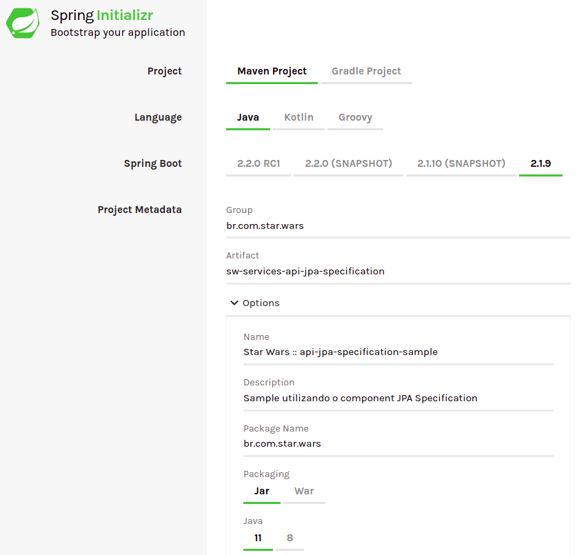
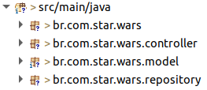

# API JPA Specification

Exemplo para utilização da técnica `specification` com o modulo **tjf-api-jpa**, conforme [documentação](https://tjf.totvs.com.br/wiki/tjf-api-jpa).

## Contexto

Para exemplificar o uso da técnica *specification*, criaremos um exemplo para busca de Droids, filtrando estes por suas características.

## Vamos Começar

Iniciaremos o desenvolvimento criando um novo projeto [Spring](https://spring.io/) utilizando o serviço [Spring Initializr](https://start.spring.io/). O projeto deve possuir as configurações conforme abaixo:



## Configurações

Após gerado, precisamos realizar pequenas alterações e inserir algumas dependências do **TJF** no arquivo `pom.xml`.

1. Altere o projeto *parent* para o seguinte:

```xml
<parent>
	<groupId>com.totvs.tjf</groupId>
	<artifactId>tjf-boot-starter</artifactId>
	<version>1.11.0-RELEASE</version>
	<relativePath  />
</parent>
```

2. Adicione as seguintes dependências do TJF:

```xml
<dependency>
	<groupId>com.totvs.tjf</groupId>
	<artifactId>tjf-api-jpa</artifactId>
</dependency>
```

3. Adicione a dependência do banco H2:

```xml
<dependency>
	<groupId>com.h2database</groupId>
	<artifactId>h2</artifactId>
</dependency>
```

4. Adicione o repositório de RELEASE do TJF:

```xml
<repositories>
	<repository>
		<id>tjf-release</id>
		<name>TOTVS Java Framework: Releases</name>
		<url>http://maven.engpro.totvs.com.br/artifactory/libs-release/</url>
	</repository>
</repositories>
```

## Vamos codificar

Durante este exemplo criaremos uma classe modelo que representará os Droids, um controller para realizarmos as buscas, uma interface de repositório para os Droids e uma classe para separarmos as técnicas de *specification*.

Com isso precisaremos da seguinte estrutura de pacotes:



Antes de iniciarmos a codificação, vamos configurar o uso do *hibernate* e do banco de dados *H2*, para isso renomeie o arquivo `application.properties` para `application.yml`, e insira neste o seguinte fonte.

```yaml
spring:
  h2:
    console:
      enabled: true
      path: /h2

  datasource:
    driver-class-name: org.h2.Driver
    url: jdbc:h2:mem:starwarsdb
    username: sa
    password:

  jpa:
    database-platform: org.hibernate.dialect.H2Dialect
    hibernate:
        ddl-auto: update
    properties:
      hibernate:
        show_sql: true
        format_sql: true
```

Feitas as configurações, vamos criar um script para criação dos nossos Droids, assim quando iniciarmos a aplicação nosso banco de dados será preenchido de forma automática. Para isso na pasta `src/main/resources` crie o arquivo *data.sql* com o seguinte script.

```sql
INSERT INTO droid (name, function, height) VALUES ('Super Battle Droid', 'Super Soldado de Batalha', 1.91);
INSERT INTO droid (name, function, height) VALUES ('Protocol Droid', 'Auxiliam diplomantas e políticos; Programados em etiqueta e equipados com formidáveis ​​habilidades linguísticas', 1.70);
INSERT INTO droid (name, function, height) VALUES ('Sith Probe Droid', 'Rastrear fugitivos', 0.3);
INSERT INTO droid (name, function, height) VALUES ('Battle Droid' , 'Substituir humanos no campo de batalha, usando a quantidade em seu favor', 1.93);
INSERT INTO droid (name, function, height) VALUES ('Mouse Droid', 'Entregar Mensagens; Guiar Visitantes', 0.25);
```

Agora estamos prontos para começarmos nosso código fonte. Vamos iniciar acrescentando a anotação responsável por habilitar a utilização do *JpaRepository*, para isso na nossa classe `application` encontrada no pacote `br.com.star.wars` adicione a seguinte anotação.

```java
@EnableJpaRepositories(repositoryBaseClass = ApiJpaRepositoryImpl.class)
```

Feito isso vamos criar nosso Droid, para isso no pacote `br.com.star.wars.model` crie a classe `Droid`, que será responsável para criação do nosso objeto e tabela no banco de dados, e insira o seguinte fonte:

```java
package br.com.star.wars.model;

@Entity
public class Droid {

	@Id
	@GeneratedValue(strategy = GenerationType.IDENTITY)
	private int id;
	private String name;
	private String function;
	private double height;

	public Droid() {
	}

	public Droid(int id, String name, String function, double height) {
		this.id = id;
		this.name = name;
		this.function = function;
		this.height = height;
	}

	// Getters and Setters
}
```

Após a criação do modelo, criaremos nossa classe de repositório, que será responsável por acessar o banco de dados e realizar nossas consultas com a técnica de *specification*. Para isso no pacote `br.com.star.wars.repository` crie a interface `DroidRepository` com o seguinte fonte:

```java
package br.com.star.wars.repository;

@Repository
@Transactional
public interface DroidRepository extends JpaRepository<Droid, Integer>, ApiJpaRepository<Droid> {}
```

Com isso temos acesso ao nosso banco de dados de forma simples, para provar isso criaremos nossa classe de *controller*, que usaremos para realizar essas buscas. Sendo assim no pacote `br.com.star.wars.controller` crie a classe `DroidController` com o seguinte fonte:

```java
package br.com.star.wars.controller;

@RestController
@RequestMapping(path = DroidController.PATH, produces = APPLICATION_JSON_VALUE)
@ApiGuideline(ApiGuidelineVersion.v1)
public class DroidController {

	public static final String PATH = "api/v1/droid";

	@Autowired
	DroidRepository droidRepository;

	@GetMapping(path = "/findAll")
	@ResponseStatus(code = HttpStatus.OK)
	public List<Droid> findAllDroids() {
		return droidRepository.findAll();
	}
}
```

Feito isso estamos prontos para testar o que fizemos até agora. Inicie sua aplicação spring, quando a mesma estiver iniciada faça a seguinte requisição:

```http
GET /api/v1/droid/findAll HTTP/1.1
Host: localhost:8080
```

O resultado que esperamos é o seguinte:

```json
[
    {
        "id": 1,
        "name": "Super Battle Droid",
        "function": "Super Soldado de Batalha",
        "height": 1.91
    },
    {
        "id": 2,
        "name": "Protocol Droid",
        "function": "Auxiliam diplomantas e políticos; Programados em etiqueta e equipados com formidáveis ​​habilidades linguísticas",
        "height": 1.7
    },
    {
        "id": 3,
        "name": "Sith Probe Droid",
        "function": "Rastrear fugitivos",
        "height": 0.3
    },
    {
        "id": 4,
        "name": "Battle Droid",
        "function": "Substituir humanos no campo de batalha, usando a quantidade em seu favor",
        "height": 1.93
    },
    {
        "id": 5,
        "name": "Mouse Droid",
        "function": "Entregar Mensagens; Guiar Visitantes",
        "height": 0.25
    }
]
```

Observe que essa requisição trouxe todos os dados que criamos no script `data.sql`, ou seja, está funcionando, mas agora queremos aplicar alguns filtros para reduzir essa busca, e para isso escolhemos utilizar a técnica de *specification*. Então vamos criar nossas regras que utilizem o *specification*, dessa forma no pacote `br.com.star.wars.model` crie a classe `DroidSpecification`, nela criaremos 4 modelos de pesquisa, porém existem vários outros que podem ser explorados. 

> Observe que utilizaremos *lambda* para facilitar o desenvolvimento.

O primeiro modelo que criaremos será utilizando a função de comparação **equal**, onde iremos filtrar os Droids por nome, para isso crie o seguinte método:

```java
public static Specification<Droid> nameEq(String name) {
	return (root, query, cb) -> cb.equal(root.get("name"), name);
}
```

O segundo modelo que aplicaremos será utilizando função **like**, dessa forma iremos filtrar os Droids por suas funções, da seguinte forma:

```java
public static Specification<Droid> functionLike(String function) {
	return (root, query, cb) -> cb.like(cb.upper(root.get("function")),
			DroidSpecification.likeConstructor(function));
}

// Método responsável por inserir o carácter % para utilização da função like
private static String likeConstructor(String term) {
	return new StringBuilder().append('%').append(term.trim().toUpperCase()).append('%').toString();
}
```

O terceiro modelo que iremos aplicar, utiliza a função **between** dessa forma filtraremos nossos Droids pela sua altura, conforme o seguinte método:

```java
public static Specification<Droid> heightBetween(double from, double util) {
	return (root, query, cb) -> cb.between(root.get("height"), from, util);
}
```

E para finalizar vamos realizar uma consulta utilizando uma **sub query**, não se assuste pois será muito fácil realizar essa consulta, basta criar o seguinte método:

```java
public static Specification<Droid> droidExists(double height) {
	return (root, query, cb) -> {
		Subquery<Droid> subQuery = query.subquery(Droid.class);
		Root<Droid> subRoot = subQuery.from(Droid.class);

		return cb.exists(subQuery.select(subRoot).where(cb.le(subRoot.get("height"), height),
				cb.equal(subRoot.get("id"), root.get("id"))));
	};
}
```

Feito isso precisamos testar e ver se esses métodos vão realizar os filtros de forma correta, com isso iremos criar novas requisições que utilizem os métodos do *specification*.

## Vamos Testar

Para testarmos em nossa classe *controller*, iremos criar 4 novas requisições que irão utilizar os filtros de *specification*.

Para validar o filtro pro nome, utilize a seguinte busca para testar:

```java
@GetMapping(path = "/findByName/{name}")
@ResponseStatus(code = HttpStatus.OK)
public ApiCollectionResponse<Droid> findDroidByName(@PathVariable("name") String name) {
	ApiPageRequest pageRequest = new ApiPageRequest();
	Specification<Droid> specs = Specification.where(DroidSpecification.nameEq(name));

	return droidRepository.findAll(pageRequest, specs);
}
```

Realize a seguinte requisição:

```http
GET /api/v1/droid/findByName/Battle Droid HTTP/1.1
Host: localhost:8080
```

E teremos o seguinte retorno:

```json
{
    "hasNext": false,
    "items": [
        {
            "id": 4,
            "name": "Battle Droid",
            "function": "Substituir humanos no campo de batalha, usando a quantidade em seu favor",
            "height": 1.93
        }
    ]
}
```

Nossa próxima busca será baseada no filtro de descrição, para isso insira o seguinte método:

```java
@GetMapping(path = "/findLike/{function}")
@ResponseStatus(code = HttpStatus.OK)
public ApiCollectionResponse<Droid> findDroidLikeDescription(@PathVariable("function") String function) {
	ApiPageRequest pageRequest = new ApiPageRequest();
	Specification<Droid> specs = Specification.where(DroidSpecification.functionLike(function));

	return droidRepository.findAll(pageRequest, specs);
}
```

Realize a seguinte requisição:

```http
GET /api/v1/droid/findLike/etiqueta HTTP/1.1
Host: localhost:8080
```

E teremos o seguinte retorno:

```json
{
    "hasNext": false,
    "items": [
        {
            "id": 2,
            "name": "Protocol Droid",
            "function": "Auxiliam diplomantas e políticos; Programados em etiqueta e equipados com formidáveis ​​habilidades linguísticas",
            "height": 1.7
        }
    ]
}
```

Para nossa próxima busca iremos realizar o filtro pela altura dos Droids, para isso insira o seguinte método:

```java
@GetMapping(path = "/findBetween")
@ResponseStatus(code = HttpStatus.OK)
public ApiCollectionResponse<Droid> findDroidBetweenHeight(@RequestHeader(name = "from") double from,
		@RequestHeader(name = "util") double util) {
	ApiPageRequest pageRequest = new ApiPageRequest();

	Specification<Droid> specs = Specification.where(DroidSpecification.heightBetween(from, util));

	return droidRepository.findAll(pageRequest, specs);
}
```

Realize a seguinte requisição:

```http
GET /api/v1/droid/findBetween HTTP/1.1
from: 1
util: 2
Host: localhost:8080
```

E teremos o seguinte retorno:

```json
{
    "hasNext": false,
    "items": [
        {
            "id": 1,
            "name": "Super Battle Droid",
            "function": "Super Soldado de Batalha",
            "height": 1.91
        },
        {
            "id": 2,
            "name": "Protocol Droid",
            "function": "Auxiliam diplomantas e políticos; Programados em etiqueta e equipados com formidáveis ​​habilidades linguísticas",
            "height": 1.7
        },
        {
            "id": 4,
            "name": "Battle Droid",
            "function": "Substituir humanos no campo de batalha, usando a quantidade em seu favor",
            "height": 1.93
        }
    ]
}
```

E para finalizar utilizaremos a busca de sub query criada, para isso insira o seguinte método: 

```java
@GetMapping(path = "/findExists/{height}")
@ResponseStatus(code = HttpStatus.OK)
public ApiCollectionResponse<Droid> findDroidExists(@PathVariable("height") double height) {
	ApiPageRequest pageRequest = new ApiPageRequest();
	Specification<Droid> specs = Specification.where(DroidSpecification.droidExists(height));

	return droidRepository.findAll(pageRequest, specs);
}
```

Realize a seguinte requisição:

```http
GET /api/v1/droid/findExists/0.29 HTTP/1.1
Host: localhost:8080
```

E teremos o seguinte retorno:

```json
{
    "hasNext": false,
    "items": [
        {
            "id": 5,
            "name": "Mouse Droid",
            "function": "Entregar Mensagens; Guiar Visitantes",
            "height": 0.25
        }
    ]
}
```

## Isso é tudo pessoal

Com isso terminamos nosso exemplo, fique a vontade para criar novos filtros. Caso sentiu falta de algo em nosso exemplo, faça um pull request para o mesmo, que iremos avaliar e disponibilizar o mesmo para todos. Não esqueça de acessar nosso [portal](https://tjf.totvs.com.br/home) para seguir as documentações.

> May the force be with you.