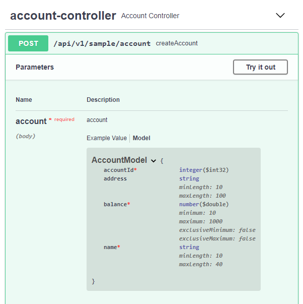

# Exemplo de uso do componente Core Validation

## Contexto

Para exemplificar o uso da biblioteca **Core Validation** vamos utilizar um exemplo simples com uma API REST para criação de contas.

## Começando

Para criação deste exemplo, vamos iniciar a explicação a partir de um projeto Spring já criado, caso você não possua um projeto criado basta acessar o [Spring initializr](https:/start.spring.io) e criar o projeto.

Para fácil entendimento do componente **TJF Core Validation** vamos seguir a sequência abaixo para criação do exemplo.

### Dependências

Para utilização do componente será necessário alterar o _parent_ e inserir a seguinte dependência em seu arquivo `pom.xml`:

```xml
<parent>
  <groupId>com.totvs.tjf</groupId>
  <artifactId>tjf-boot-starter</artifactId>
  <version>2.6.0-RELEASE</version>
</parent>
```

```xml
<dependency>
    <groupId>com.totvs.tjf</groupId>
    <artifactId>tjf-core-validation</artifactId>
</dependency>
```

Como iremos criar uma API REST, para facilitar a criação do modelo, vamos utilizar também o Lombok como dependência:

```xml
<dependency>
  <groupId>org.projectlombok</groupId>
  <artifactId>lombok</artifactId>
</dependency>
```

> Saiba mais sobre o o [Lombok](https://projectlombok.org/).

Também adicionaremos o Spring Fox Swagger como dependência para a demonstração:

```xml
<dependency>
  <groupId>io.springfox</groupId>
  <artifactId>springfox-swagger2</artifactId>
  <version>2.9.2</version>
</dependency>

<dependency>
  <groupId>io.springfox</groupId>
  <artifactId>springfox-bean-validators</artifactId>
  <version>2.9.2</version>
</dependency>
```

> Saiba mais sobre o [Spring Fox Swagger](https://www.baeldung.com/swagger-2-documentation-for-spring-rest-api).

## Criando o código fonte

Agora, com as dependências já definidas, podemos criar nossos códigos fontes. Começaremos então pela criação da classe que representará a entidade _account_:

_AccountModel.java_

```java
@Getter
@Setter
@NoArgsConstructor
@AllArgsConstructor
public class AccountModel {

  @NotNull
  private int accountId;

  @NotNull(message = "Nome não pode ser nulo!")
  @Size(min = 4, max = 40)
  private String name;

  @Size(min = 10, max = 100)
  private String address;

  @NotNull
  @Min(value = 10, message = "Valor minimo é 10!")
  @Max(value = 1000, message = "Valor maximo é 1000!")
  private Double balance;

```

Agora vamos criar a nossa API REST:

_AccountController.java_

```java
@RestController
@RequestMapping(path = "/api/v1/sample", produces = APPLICATION_JSON_VALUE)
public class AccountController {

	@Autowired
	private ValidatorService validator;

	@PostMapping("account")
	public void createAccount(@RequestBody AccountModel account) {
		validator.validate(account).ifPresent(violations -> {
			throw new AccountException(violations);
		});
	}

}
```

Vamos criar também uma classe de exceção:

_AccountException.java_

```java
public class AccountException extends ConstraintViolationException {

	private static final long serialVersionUID = 1L;

	public AccountException(Set<? extends ConstraintViolation<?>> constraintViolations) {
		super(constraintViolations);
	}

}
```

Por fim, vamos configurar o Spring Fox Swagger 2 para nossa aplicação:

_SwaggerConfiguration.java_

```java
@Configuration
@EnableSwagger2
public class SwaggerConfiguration {

	@Bean
	public Docket apiDocket() {
		return new Docket(DocumentationType.SWAGGER_2).select().apis(RequestHandlerSelectors.any())
				.paths(PathSelectors.any()).build();
	}

}
```

## Vamos testar?

Bom, já terminamos nosso _sample_ e agora podemos brincar um pouco com o que foi implementado. O primeiro teste que podemos fazer, após subir a aplicação, é verificar o endpoint `http://localhost:8080/v2/api-docs`. Após inserir o `JSON` gerado em um **Swagger Editor**, teremos o resultado a seguir:



Nele podemos ver todas as validações que foram incluídas no nosso _sample_.

Agora vamos testar o _ValidatorService_ e nosso tratamento de exceções fazendo uma requisição `POST` para o endpoint `http://localhost:8080/api/v1/sample/account` com o conteúdo abaixo no body.

```json
{
  "accountId": 10,
  "name": "Sample",
  "address": "Projeto",
  "balance": 4000.0
}
```

E teremos o seguinte retorno a partir da nossa validação:

```json
{
  "timestamp": "2019-05-08T18:58:41.848+0000",
  "status": 500,
  "error": "Internal Server Error",
  "message": "address: tamanho deve estar entre 10 e 100, balance: Valor maximo é 1000!",
  "path": "/api/v1/sample/account"
}
```

## Que a força esteja com você!

Com isso terminamos nosso exemplo, fique a vontade para incrementar o exemplo utilizando todos os recursos proposto pelo componente **Core Validation**, caso necessário utilize nossa [documentação](https://tjf.totvs.com.br/wiki/tjf-core-validation) e fique a vontade para mandar sugestões e melhorias para o projeto [TJF](https://tjf.totvs.com.br/).
