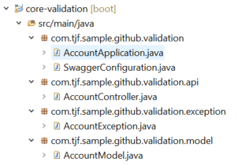

# Exemplo de uso do componente Core Validation

## Contexto

Para explicação do componente **TJF Core Validation** vamos utilizar um exemplo simples com uma classe de Contas (account) de um banco.

## Começando com o TJF Core Validation

Para criação deste exemplo, vamos iniciar a explicação a partir de um projeto Spring já criado, caso você não possua um projeto criado basta acessar o [Spring initializr](https:/start.spring.io) e criar o projeto.

Para fácil entendimento do componente **TJF Core Validation** vamos seguir a sequencia a baixo para criação do exemplo.

### Dependências

Para utilização do componente será necessário inserir a seguinte dependência em seu arquivo pom.xml.

```xml
<parent>
	<groupId>com.totvs.tjf</groupId>
	<artifactId>tjf-boot-starter</artifactId>
	<version>1.11.0-RELEASE</version>
</parent>
```

```xml
<dependency>
    <groupId>com.totvs.tjf</groupId>
    <artifactId>tjf-core-validation</artifactId>
</dependency>
```

Como iremos criar um micro serviço REST, para facilitar a criação do Model, vamos utilizar o Lombok como dependência.

```xml
<dependency>
	<groupId>org.projectlombok</groupId>
	<artifactId>lombok</artifactId>
	<version>1.18.8</version>
	<scope>provided</scope>
</dependency>
```

Mais informações sobre o Lombok: [https://projectlombok.org/](https://projectlombok.org/)

Para demonstrar o suporte ao Spring Fox Swagger, também o teremos como dependência:

```xml
<dependency>
	<groupId>io.springfox</groupId>
	<artifactId>springfox-swagger2</artifactId>
	<version>2.9.2</version>
</dependency>

<dependency>
	<groupId>io.springfox</groupId>
   	<artifactId>springfox-bean-validators</artifactId>
   	<version>2.9.2</version>
</dependency>
```
Mais informações sobre o Spring Fox Swagger: [Setting Up Swagger 2 with a Spring REST API](https://www.baeldung.com/swagger-2-documentation-for-spring-rest-api)

### Criando o código fonte
Agora, com as dependências já definidas, podemos criar nossos códigos fontes. Para começar, vamos criar os pacotes do projeto, utilizando os seguintes nomes:
* com.tjf.sample.github.validation
* com.tjf.sample.github.validation.api
* com.tjf.sample.github.validation.exception
* com.tjf.sample.github.validation.model

Que no final ficará assim:



**Importante**: *Em nosso **SpringApplication** não iremos fazer alterações,* se houver interesse, o nome poderá ser alterado para AccountApplication.

Bom, vamos lá! Começaremos pelo pacote Model, onde ficará nosso modelo do dominio de nossa aplicação. Vamos criar apenas uma classe.

*AccountModel.java*

```java
package com.tjf.sample.github.validation.model;

import javax.validation.constraints.Max;
import javax.validation.constraints.Min;
import javax.validation.constraints.NotEmpty;
import javax.validation.constraints.NotNull;
import javax.validation.constraints.Size;

import lombok.AllArgsConstructor;
import lombok.Builder;
import lombok.Data;
import lombok.NoArgsConstructor;

@Data
@Builder
@NoArgsConstructor
@AllArgsConstructor
public class AccountModel {

	@NotNull
	private Integer accountId;

	@NotNull(message = "Nome não pode ser nulo!")
	@Size(min = 4, max = 40)
	private String name;

	@Size(min = 10, max = 100)
	private String address;

	@NotNull
   	@Min(value = 10, message = "Valor minimo é 10!")
	@Max(value = 1000, message = "Valor maximo é 1000!")
	private Double balance;

}
```

Agora vamos criar o Controller da nossa API.

*AccountController.java*

```java
package com.tjf.sample.github.validation.api;

import static org.springframework.http.MediaType.APPLICATION_JSON_VALUE;

import org.springframework.beans.factory.annotation.Autowired;
import org.springframework.web.bind.annotation.PostMapping;
import org.springframework.web.bind.annotation.RequestBody;
import org.springframework.web.bind.annotation.RequestMapping;
import org.springframework.web.bind.annotation.RestController;

import com.tjf.sample.github.validation.exception.AccountContraintException;
import com.tjf.sample.github.validation.model.AccountModel;
import com.totvs.tjf.core.validation.ValidatorService;

@RestController
@RequestMapping(path = "/api/v1/sample", produces = { APPLICATION_JSON_VALUE })
public class AccountController {

    @Autowired
    private ValidatorService validator;

	@PostMapping("account")
	public void createAccount(@RequestBody AccountModel account) {

        validator.validate(account).ifPresent(violations -> {
        	throw new AccountContraintException(violations);
        });
	}
}
```
Bom, agora vamos para a nossa classe responsável pelas Exceçoes:

*AccountException.java*

```java
package com.tjf.sample.github.validation.exception;

import java.util.Set;

import javax.validation.ConstraintViolation;
import javax.validation.ConstraintViolationException;

public class AccountException extends ConstraintViolationException {

	private static final long serialVersionUID = 1L;

	public AccountException(Set<? extends ConstraintViolation<?>> constraintViolations) {
		super(constraintViolations);
	}
}
```

Por fim, vamos configurar o Spring Fox Swagger 2 para nossa aplicação:

*SwaggerConfiguration.java*

```java
package com.tjf.sample.github.validation;

import org.springframework.context.annotation.Bean;
import org.springframework.context.annotation.Configuration;

import springfox.documentation.builders.PathSelectors;
import springfox.documentation.builders.RequestHandlerSelectors;
import springfox.documentation.spi.DocumentationType;
import springfox.documentation.spring.web.plugins.Docket;
import springfox.documentation.swagger2.annotations.EnableSwagger2;

@Configuration
@EnableSwagger2
public class SwaggerConfiguration {
    @Bean
    public Docket apiDocket() {
        return new Docket(DocumentationType.SWAGGER_2)
                .select()
                .apis(RequestHandlerSelectors.any())
                .paths(PathSelectors.any())
                .build();
    }
}

```

### Vamos testar?

Bom, já terminamos nosso *sample* e agora podemos brincar um pouco com o que foi implementado. O primeiro teste que podemos fazer, após subir a aplicação, é verificar o endpoint *http://localhost:8080/v2/api-docs*. Após jogar aquele Json gerado em um Swagger Editor, teremos o resultado a seguir:


Nele podemos ver todas as validações que foram incluídas no nosso *sample*.

Agora vamos testar o *ValidatorService* e nosso tratamento de exceções, seguindo os passos abaixo:

* Primeiro, vamos enviar um POST para o endpoint *http://localhost:8080/api/v1/sample/account* com o conteúdo abaixo no body.

```json
{
	"accountId":10,
	"name":"Sample",
	"address":"Projeto",
	"balance":4000.0
}
```
Teremos no retorno:

```json
{
    "timestamp": "2019-05-08T18:58:41.848+0000",
    "status": 500,
    "error": "Internal Server Error",
    "message": "address: tamanho deve estar entre 10 e 100, balance: Valor maximo é 1000!",
    "path": "/api/v1/sample/account"
}
```

* Agora vamos verificar nossa exception no log...

```properties
com.tjf.sample.github.validation.exception.AccountException: address: tamanho deve estar entre 10 e 100, balance: Valor maximo é 1000!
```

## Finalizando

Pronto! Agora já poderemos implementar as funcionalidades do módulo **TJF-CORE-VALIDATION** nos nossos projetos. Lembrando que as informações técnicas se encontram no próprio README.md do módulo.