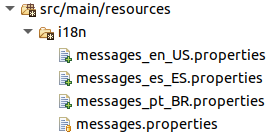
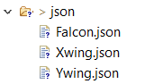
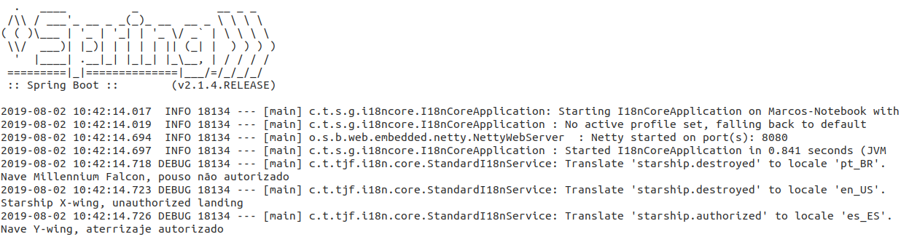

# Exemplo de uso do componente i18n Core

## Contexto

Para exemplificar o uso da biblioteca **i18n Core** vamos criar uma base de comunicação para um portão de pouso de naves.

## Começando

Para criação deste exemplo vamos iniciar a explicação a partir de um projeto Spring já criado, caso você não possua um projeto criado basta acessar o [Spring initializr](https://start.spring.io/) e criar o projeto.

Para fácil entendimento do componente **i18n Core** vamos seguir a sequencia abaixo para criação do exemplo.

### Dependências

Para utilização do componente de tradução é necessário inserir a seguinte dependência em seu arquivo `pom.xml`:

```xml
<dependency>
  <groupId>com.totvs.tjf</groupId>
  <artifactId>tjf-i18n-core</artifactId>
  <version>2.6.0-RELEASE</version>
</dependency>
```

Em nosso exemplo iremos utilizar um arquivo `JSON` como base, para isso adicione também a seguinte dependência:

```xml
<dependency>
  <groupId>com.fasterxml.jackson.core</groupId>
  <artifactId>jackson-databind</artifactId>
</dependency>
```

### Criando as mensagens de tradução

Antes de iniciar o desenvolvimento vamos criar a estrutura de mensagens.

Para isso na pasta de `resources` do seu projeto crie uma pasta com o nome `i18n`. Após criar a estrutura de pastas, devemos criar os arquivos de mensagens, com os respectivos nome:

- `messages.properties`: Este será o arquivo padrão de mensagens, para caso a tradução não for encontrada em outros arquivos.
- `messages_pt_BR.properties`: Mensagens em português.
- `messages_en_US.properties`: Mensagens em inglês.
- `messages_es_ES.properties`: Mensagens em espanhol.



Com a estrutura criada, vamos inserir algumas mensagens padrões para o sistema, para cada uma delas devemos informar um código de identificação. Neste caso vamos criar duas mensagens, editando o arquivo `messages.properties` e insirindo as seguintes linhas:

```properties
starship.authorized = Nave {0}, pouso autorizado
starship.destroyed = Nave {0}, pouso n\u00e3o autorizado
```

Replique para os outros arquivos de mensagens e faça a tradução conforme o idioma definido no nome do arquivo, sem alterar o código da mensagem.

### Criando os arquivos de leitura

Para nosso exemplo iremos criar três arquivos `JSON` para leitura das informações, dessa forma crie na pasta de `resources` uma pasta com o nome `json` e adicione os seguintes arquivos com seus respectivos conteúdos:

**Falcon.json**

```json
{
  "name": "Millennium Falcon",
  "model": "YT-1300 light freighter",
  "manufacturer": "Corellian Engineering Corporation",
  "cost_in_credits": "100000",
  "length": "34.37",
  "max_atmosphering_speed": "1050",
  "crew": "4",
  "passengers": "6",
  "cargo_capacity": "100000",
  "consumables": "2 months",
  "hyperdrive_rating": "0.5",
  "MGLT": "75",
  "starship_class": "Light freighter"
}
```

**Xwing.json**

```json
{
  "name": "X-wing",
  "model": "T-65 X-wing",
  "manufacturer": "Incom Corporation",
  "cost_in_credits": "149999",
  "length": "12.5",
  "max_atmosphering_speed": "1050",
  "crew": "1",
  "passengers": "0",
  "cargo_capacity": "110",
  "consumables": "1 week",
  "hyperdrive_rating": "1.0",
  "MGLT": "100",
  "starship_class": "Starfighter"
}
```

**Ywing.json**

```json
{
  "name": "Y-wing",
  "model": "BTL Y-wing",
  "manufacturer": "Koensayr Manufacturing",
  "cost_in_credits": "134999",
  "length": "14",
  "max_atmosphering_speed": "1000km",
  "crew": "2",
  "passengers": "0",
  "cargo_capacity": "110",
  "consumables": "1 week",
  "hyperdrive_rating": "1.0",
  "MGLT": "80",
  "starship_class": "assault starfighter"
}
```

Após finalizado teremos a seguinte estrutura:



## Codificando

Agora com as dependências e a estrutura de _resources_ do projeto prontas, vamos criar nosso código fontes, iniciando pela classe de domínio:

**Starship.java**

```java
@Getter
@Setter
@NoArgsConstructor
public class Starship {

  private String name;
  private String model;
  private String manufacturer;
  private String cost;
  private String passengers;
  private String cargoCapacity;

}
```

Agora vamos desenvolver a classe de serviço responsável por ler os arquivos `JSON`:

**StarshipService.java**

```java
@Component
public class StarshipService {

  @Autowired
  private ObjectMapper objectMapper;

  public Starship getStarshipInfo(String shipInfo) throws IOException {
    ClassLoader classLoader = StarshipService.class.getClassLoader();
    File file = new File(classLoader.getResource("json/" + shipInfo).getFile());

    String content = new String(Files.readAllBytes(file.toPath()));
    return objectMapper.readValue(content, Starship.class);
  }

}
```

E agora vamos criar a classe responsável por retornar as mensagens que criamos, conforme o tipo da nave:

> :warning: **Atenção**: é nesta etapa teremos a interação com o componente **i18n Core** chamando as mensagens criadas anteriormente e passando um atributo para a mesma, respectivo ao parâmetro `{0}` que está na mensagem.

**StarshipMessage.java**

```java
@Component
public class StarshipMessage {

  @Autowired
  private I18nService i18nService;

  public String starshipConfirmLanding(String starshipName) {
    return this.i18nService.getMessage("starship.authorized", starshipName);
  }

  public String starshipDestroy(String starshipName) {
    return this.i18nService.getMessage("starship.destroyed", starshipName);
  }

}
```

Por fim, vamos criar as classes que irão executar o processo de autorização de pouso das naves. Primeiramente criando a classe que é responsável pela chamada dos serviços e permitir ou não o pouso das naves de forma randômica:

**AuthorizedGate.java**

```java
@Component
public class AuthorizedGate {

  @Autowired
  private StarshipService starshipService;

  @Autowired
  private StarshipMessage starshipMessage;

  private Random random = new Random();

  public String authorizedShipLanding(String shipCard) throws IOException {

    Starship starship = starshipService.getStarshipInfo(shipCard);

    if (random.nextBoolean()) {
      return starshipMessage.starshipConfirmLanding(starship.getName());
    } else {
      return starshipMessage.starshipDestroy(starship.getName());
    }

  }

}
```

E depois criando a classe dá início ao nosso processo por implementar o componente `CommandLineRuner`:

**MainGate.java**

```java
@Component
public class MainGate implements CommandLineRunner {

  @Autowired
  private AuthorizedGate authorizedGate;

  @Override
  public void run(String... args) throws Exception {
    enableI18nDebugLog();

    Locale.setDefault(new Locale("pt", "br"));
    System.out.println(authorizedGate.authorizedShipLanding("Falcon.json"));
    Locale.setDefault(new Locale("en", "us"));
    System.out.println(authorizedGate.authorizedShipLanding("Xwing.json"));
    Locale.setDefault(new Locale("es", "es"));
    System.out.println(authorizedGate.authorizedShipLanding("Ywing.json"));
  }

  public void enableI18nDebugLog() {
    LoggerContext loggerContext = (LoggerContext) LoggerFactory.getILoggerFactory();
    Logger rootLogger = loggerContext.getLogger("com.totvs.tjf.i18n");
    rootLogger.setLevel(Level.DEBUG);
  }

}
```

## Vamos testar?

Para realizarmos o teste do nosso exemplo, execute a classe da aplicação e teremos em nosso console as seguintes mensagens:



> :warning: Veja que tem um log de debug no `tjf-i18n`, ele mostra a chave e o _locale_ usados para a internacionalização. Por exemplo, para o _locale_ `en-US` o arquivo que será usado é o `messages-en_US.properties`.

## Que a força esteja com você!

Com isso terminamos nosso exemplo, fique a vontade para incrementar o exemplo utilizando todos os recursos proposto pelo componente **i18n Core**, caso necessário utilize nossa [documentação](https://tjf.totvs.com.br/wiki/tjf-i18n-core) e fique a vontade para mandar sugestões e melhorias para o projeto [TJF](https://tjf.totvs.com.br/).
