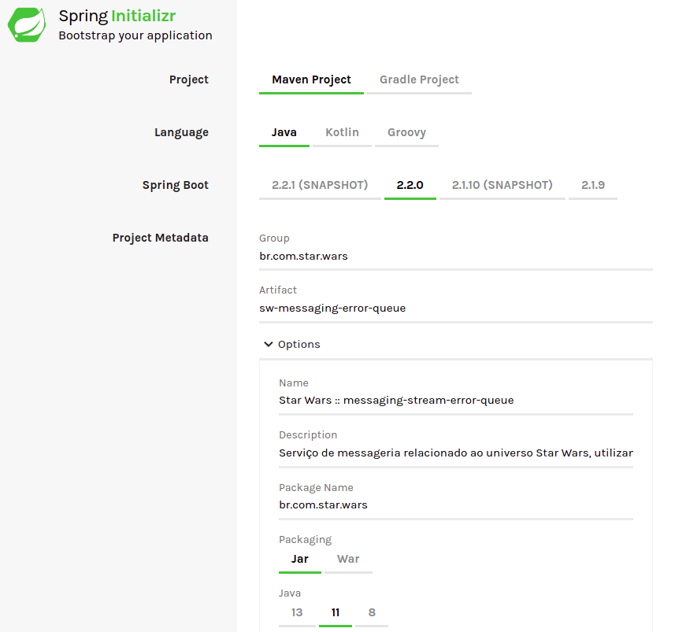
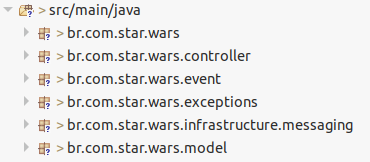

# Messaging Stream - Filas de Erro

Exemplo para utilização das filas de erro utilizando o modulo [tjf-messaging-stream](https://tjf.totvs.com.br/wiki/tjf-messaging-stream) do TJF.

## Contexto

Para exemplificar a utilização das filas de erro, iremos utilizar uma unidade BB que será responsável por garantir a segurança da mensagem contendo a localização do Luke Skywalker.

## Vamos Começar

Iniciaremos o desenvolvimento criando um novo projeto [Spring](https://spring.io/) utilizando o serviço [Spring Initializr](https://start.spring.io/). O projeto deve possuir as configurações conforme abaixo:



## Configurações

Após gerado, precisamos realizar pequenas alterações e inserir algumas dependências do **TJF** no arquivo `pom.xml`.

1. Altere o projeto *parent* para o seguinte:

```xml
<parent>
	<groupId>com.totvs.tjf</groupId>
	<artifactId>tjf-boot-starter</artifactId>
	<version>1.11.0-RELEASE</version>
	<relativePath  />
</parent>
```

2. Adicione as seguintes dependências do TJF:

```xml
<dependency>
	<groupId>com.totvs.tjf</groupId>
	<artifactId>tjf-api-context</artifactId>
</dependency>

<dependency>
	<groupId>com.totvs.tjf</groupId>
	<artifactId>tjf-core-validation</artifactId>
</dependency>

<dependency>
	<groupId>com.totvs.tjf</groupId>
	<artifactId>tjf-messaging-stream</artifactId>
</dependency>
```

3. Adicione o repositório de RELEASE do TJF:

```xml
<repositories>
	<repository>
		<id>tjf-release</id>
		<name>TOTVS Java Framework: Releases</name>
		<url>http://maven.engpro.totvs.com.br/artifactory/libs-release/</url>
	</repository>
</repositories>
```

## Vamos codificar

Durante este exemplo criaremos uma classe modelo que representará a unidade BB, um controller para realizarmos o envio da mensagem e sua missão, classes de infraestrutura para o envio das mensagens e recebimento das mesmas, uma classe de evento para as mensagens e uma classe para exceção de erro.

Com isso precisaremos da seguinte estrutura de pacotes:



Antes de iniciarmos a codificação, vamos configurar o uso das filas de mensagens, para isso renomeie o arquivo `application.properties` para `application.yml`, e insira neste o seguinte fonte.

```yaml
spring:
  cloud:
    stream:
      defaultBinder: rabbit1
      bindings:
        # Filas de Execução
        bbunit-input:
          destination: bbunit-input
          group: requests
          consumer:
            max-attempts: 1          
        bbunit-output:
          destination: bbunit-input
        # Filas de Erros
        tjf-messaging-error-input:
          destination: bbunit-errors
          group: errors
        tjf-messaging-error-output:
          destination: bbunit-errors
          group: errors
          producer:
            requiredGroups: errors
                      
      binders:
        rabbit1:
          type: rabbit
          environment:
            spring:
              rabbit:
                host: localhost
                
management:
  endpoints:
    web:
      exposure:
        include: info,health,messaging                
                
server:
  port: 8080

```

> Para compreender de forma exata cada parâmetro utilizado, recomendamos a leitura da documentação do modulo [tjf-messaging-stream](https://tjf.totvs.com.br/wiki/tjf-messaging-stream) .

Agora estamos prontos para começarmos nosso código fonte. Vamos iniciar criando a unidade BB, para isso no pacote `br.com.star.wars.model` crie a classe `BBUnit`, que será responsável para criação do nosso objeto, e insira o seguinte fonte:

```java
package br.com.star.wars.model;

import javax.validation.constraints.NotBlank;

public class BBUnit {

	@NotBlank
	private String name;
	private String partner;
	@NotBlank
	private String mission;
	@NotBlank
	private String message;

	public BBUnit() {
	}

	public BBUnit(String name, String partner, String mission, String message) {
		this.name = name;
		this.partner = partner;
		this.mission = mission;
		this.message = message;
	}

	// Getters and Setters
}
```

Após a criação do modelo, criaremos nossa classe de *controller*, que usaremos para enviar a mensagem para nossa unidade BB. Sendo assim no pacote `br.com.star.wars.controller` crie a classe `BBUnitMissionController` com o seguinte fonte:

```java
package br.com.star.wars.controller;

@RestController
@RequestMapping(path = BBUnitMissionController.PATH, produces = APPLICATION_JSON_VALUE)
@ApiGuideline(ApiGuidelineVersion.v1)
public class BBUnitMissionController {

	public static final String PATH = "mission";

	@Autowired
	BBUnitPublisher bbPublisher;

	@PostMapping(path = "/send")
	@ResponseStatus(code = HttpStatus.CREATED)
	public ApiCollectionResponse<BBUnit> sendMessageInBBUnit(@RequestBody BBUnit bbUnit) {
		BBUnitSendMission missionEvent = new BBUnitSendMission(bbUnit);
		bbPublisher.publish(missionEvent.getBbUnit(), BBUnitSendMission.MISSION);

		return ApiCollectionResponse.of(List.of(bbUnit));
	}
}
```

Feito isso, vamos criar nossa classe de exceção, que usaremos para informar os erros de validação da nossa unidade BB, para isso no pacote `br.com.star.wars.exception` crie a classe `BBUnitException` com o seguinte fonte:

```java
package br.com.star.wars.exceptions;

@ApiError("BBUnitException")
public class BBUnitException extends ConstraintViolationException {

	private static final long serialVersionUID = 1L;

	public BBUnitException(Set<? extends ConstraintViolation<?>> constraintViolations) {
		super(constraintViolations);
	}
}
```

Dessa forma, ao receber uma mensagem com informações inválidas a mesma será enviada para fila de erros. Mas para termos um controle das mensagens, criaremos uma classe de eventos, estas classes são direcionadas para os eventos esperados para a execução de um programa. Para isso no pacote `br.com.star.wars.event` crie a classe `BBUnitSendMission` com o seguinte fonte:

```java
package br.com.star.wars.event;

public class BBUnitSendMission {

	public static final String MISSION = "BBUnitSendMission";
	public static final String CONDITIONAL_EXPRESSION = "headers['type']=='" + MISSION + "'";

	private BBUnit bbUnit;

	public BBUnitSendMission() {
	}

	public BBUnitSendMission(BBUnit bbUnit) {
		this.bbUnit = bbUnit;
	}

	public BBUnit getBbUnit() {
		return bbUnit;
	}

	public void setBbUnit(BBUnit bbUnit) {
		this.bbUnit = bbUnit;
	}
}
```

> Observe que conforme a documentação do modulo, as constantes serão utilizadas como os controladores para o envio e recebimento das mensagens.

Agora podemos criar a infraestrutura de mensagens, nesta criaremos três classes no pacote `br.com.star.wars.infrastructure.messaging` que serão *exchange*, *publisher* e *listener*. Vamos começar criando nosso *exchange* com o nome `BBUnitExchange` e o seguinte fonte:

```java
package br.com.star.wars.infrastructure.messaging;

public interface BBUnitExchange {
	String INPUT = "bbunit-input";

	@Input(BBUnitExchange.INPUT)
	SubscribableChannel input();

	String OUTPUT = "bbunit-output";

	@Output(BBUnitExchange.OUTPUT)
	MessageChannel output();
}
```

Agora criaremos nossa classe *publisher* com o nome `BBUnitPublisher` e o seguinte fonte:

```java
package br.com.star.wars.infrastructure.messaging;

@EnableBinding(BBUnitExchange.class)
public class BBUnitPublisher {
	BBUnitExchange exchange;

	public BBUnitPublisher(BBUnitExchange exchange) {
		this.exchange = exchange;
	}

	public <T> void publish(T event, String eventName) {
		new TOTVSMessage<T>(eventName, event).sendTo(exchange.output());
	}
}
```

E por fim criaremos o *listener* de mensagens com o nome `BBUnitSubscriber` e o seguinte fonte:

```java
package br.com.star.wars.infrastructure.messaging;

@EnableBinding(BBUnitExchange.class)
public class BBUnitSubscribe {

	@Autowired
	private ValidatorService validator;

	private static int contError;

	@WithoutTenant
	@StreamListener(target = BBUnitExchange.INPUT, condition = BBUnitSendMission.CONDITIONAL_EXPRESSION)
	public void subscribeMessageMission(TOTVSMessage<BBUnit> message) {

		if (contError == 0) {
			validator.validate(message.getContent()).ifPresent(violations -> {
				contError = 1;
				throw new BBUnitException(violations);
			});
		}
	}
}
```

Observe que existe uma variável chamada `contError` está será responsável por forçar que ocorra a exceção do nosso model quando a primeira mensagem for criada, assim a mesma será enviada para fila de erros, após isso as mensagens serão enviadas de forma normal sem ocorrer os erros.

## Vamos Testar

Para testarmos precisaremos do seguinte `docker-compose` para a criação do RabbitMq e para podermos visualizar a mensagem de erro.

```yaml
version: '3'

services:
  rabbitMq:
    image: rabbitmq:3.7.7-management
    container_name: tjf-rabbitmq
    ports:
      - 15672:15672
      - 5672:5672
```

> Para executar o mesmo, no diretório do arquivo execute o comando *docker-compose up*

Agora vamos iniciar nossa aplicação e testa-la. Após a aplicação estar no ar execute a seguinte requisição.

```http
POST /mission/send HTTP/1.1
Host: localhost:8080
Content-Type: application/json
  
{
    "name": "BB-8",
	"partner": "Poe Dameron",
    "mission": "Get the location of Luke Skywalker"
}
```

Após executada a requisição, observe que no terminal ocorreu uma exceção, está exceção ocorreu na validação do *subscribe* e envio a mensagem para fila de erro, para visualizar está mensagem acesse o RabbitMq na url *localhost:15672*, sendo usuário e senha de acesso *guest*, vá até a aba **Queues** e será possível ver as filas criadas, observe que a fila **bbunit-errors.errors** possui uma mensagem de erro, a mesma que enviamos em nossa requisição.

Conforme a documentação do modulo e configuração que fizemos anteriormente, ao executar a requisição a seguir, as mensagens de erro serão reprocessadas, feito isso ao acessar a fila novamente não teremos mais mensagens de erro.

```http
GET /actuator/messaging HTTP/1.1
Host: localhost:8080
Content-Type: application/json
```

E teremos como retorno o número de mensagens reprocessadas, no nosso caso o seguinte retorno.

```json
{
	"messages": 1
}
```

## Isso é tudo pessoal

Com isso terminamos nosso exemplo, fique a vontade para criar novas estrategias de mensagens. Caso sentiu falta de algo em nosso exemplo, faça um pull request para o mesmo, que iremos avaliar e disponibilizar o mesmo para todos. Não esqueça de acessar nosso [portal](https://tjf.totvs.com.br/home) para seguir as documentações.

> May the force be with you.