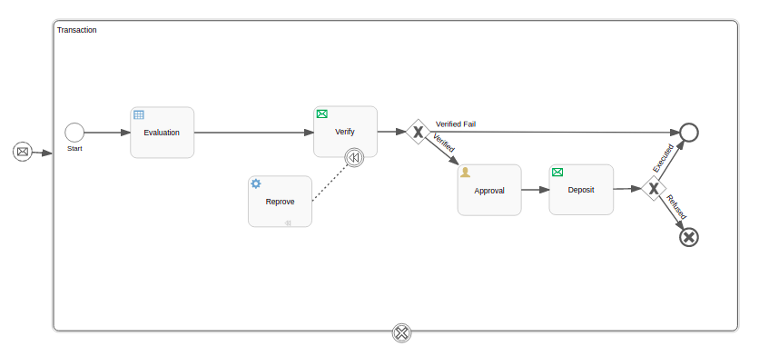
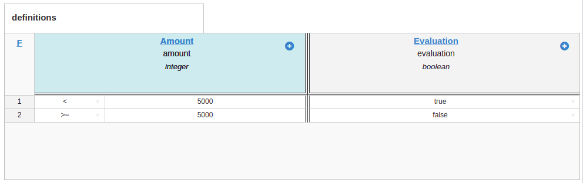
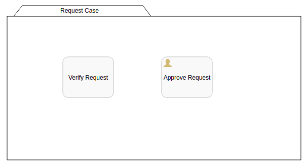

# TJF Process Service NodeJS Sample

_Sample_ de utilização do componente [__TJF Process Service__][tjf-process-service] do [__TOTVS Java Framework__][tjf] em JavaScript (NodeJS).

# Contexto

Para exemplificar o uso do componente [__Process Service__][tjf-process-service], criaremos uma aplicação que inicia um processo e responde aos comandos enviados pelo orquestrador.

As definições utilizadas nesse exemplo dizem respeito ao processo de aprovação de adiantamento de numerário para um determinado empregado, que inclui um modelo de decisão e outro de caso de gerenciamento.

<p>
  
</p>

<p>
  
</p>

<p>
  
</p>

# Infraestrutura

Certifique-se que o [__Docker__][docker] esteja corretamente instalado na sua máquina.

Utilizaremos também o [__Docker Compose__][docker-compose] para montar um ambiente com todos os componentes de infra-estrutura necessários, o que inclui o [__RabbitMQ__][rabbit], o [__PostgreSQL__][postgres] e o [__TJF Process Service__][tjf-process-service], além do próprio container [__NodeJS__][node] para executar a aplicação de exemplo.

## docker-compose.yml

```docker
version: '3'

services:

  rabbitmq:
    image: "rabbitmq:3-management"
    environment:
      RABBITMQ_DEFAULT_USER: "guest"
      RABBITMQ_DEFAULT_PASS: "guest"
    ports:
      - "9996:15672"
    volumes:
      - rabbitmq-volume:/var/lib/rabbitmq

  postgres:
    image: "postgres"
    environment:
      POSTGRES_DB: "processdb"
      POSTGRES_USER: "admin"
      POSTGRES_PASSWORD: "admin"
    ports:
      - "9997:5432"

  process:
    image: "docker.totvs.io/tjf/process-service-discriminator"
    depends_on:
      - postgres
      - rabbitmq
    volumes:
      - ./definitions:/definitions
    ports:
      - "9998:8080"
    environment:
      serviceDiscriminatorDomainExchange: "domain-exchange"
      serviceDiscriminatorDBHost: "postgres/processdb"
      serviceDiscriminatorDBUser: "admin"
      serviceDiscriminatorDBPass: "admin"
      serviceDiscriminatorRabbitHost: "rabbitmq"
      serviceDiscriminatorRabbitUsername: "guest"
      serviceDiscriminatorRabbitPassword: "guest"

  sample:
    image: "node:9"
    depends_on:
      - process
    working_dir: /home/node/app
    environment:
      - NODE_ENV=production
    volumes:
      - ./:/home/node/app
    command: bash -c "npm install && npm start"

volumes:
  rabbitmq-volume:
```

Atenção especial para a pasta <b>definitions</b>, referenciada no serviço do <b>tjf-process-service</b>, ela contêm as definições de processos, decisões e casos que utilizadas pela aplicação.

# A aplicação

Nossa aplicação em Java Script utiliza duas bibliotecas que NÃO precisam ser previamente instaladas em sua máquina, uma vez que este processo será feito no momento da execução do projeto.

```js
var waitPort = require('wait-port');
var amqplib = require('amqplib');
```
Para deixar o código da aplicação mais "limpo", abaixo temos algumas funções de "framework", responsáveis pela conexão, recebimento e envio de mensages.

```js
// FRAMEWORK

function connect (options) {
  console.info("Connecting to: ", JSON.stringify(options));
  return amqplib.connect(options).then(function (conn) {
    return conn.createChannel();
  });
}

function bind (ch, exchange, queue) {
  return Promise.all([
    ch.assertQueue(queue),
    ch.assertExchange(exchange, "topic"),
    ch.bindQueue(queue, exchange, "#"),
    ch.consume(queue, handleMessage)
  ]);
}

function handleMessage (message) {
  console.info("Receiving message: ", message.properties.headers.type);
  var type = message.properties.headers.type || "undefined";
  if (typeof subscribers[type] != 'function') {
    console.error("No subscribers found to {}", type);
  }
  else {
    subscribers[type](JSON.parse(message.content.toString()));
  }
  channel.ack(message);
}

function publish (exchange, message) {
  console.log("Publishing message: ", message.header.type)
  channel.publish(exchange, '#', Buffer.from(JSON.stringify(message)), { "headers": { "type": message.header.type } });
}
```
No bloco abaixo temos os <i>listeners</i> ou <i>subscribers</i>, funções, que via mensageria, respondem aos comandos recebidos enviando eventos para o orquestrador.

```js
// APPLICATION

var subscribers = {};

subscribers.NewRequestEvent = function (message) {
  publish("workflow-exchange", {
    "header": {
      "type": "RequestCreatedEvent",
      "tenantId": "tenant"
    },
    "content": {
      "employee": "John",
      "amount": 5000
    }
  });
};

subscribers.CaseTrueCommand = function (message) {
  message.header.type = "CaseTrueEvent";
  publish("workflow-exchange", message);
};

subscribers.CaseFalseCommand = function (message) {
  message.header.type = "CaseFalseEvent";
  publish("workflow-exchange", message);
};

subscribers.VerifyRequestCommand = function (message) {
  message.header.type = "VerifyRequestEvent";
  message.content.verified = 1;
  publish("workflow-exchange", message);
};

subscribers.RequestApprovalRequiredCommand = function (message) {
  message.header.type = "RequestApprovalRequiredEvent";
  publish("workflow-exchange", message);
};

subscribers.DepositCommand = function (message) {
  message.header.type = "DepositEvent";
  message.content.deposited = 1;
  publish("workflow-exchange", message);
};
```
O último bloco de nossa aplicação fica responsável por:

- Esperar o disponibilidade do orquestrador
- Iniciar a conexão com o Rabbit
- Fazer o <i>bind</i> da fila ("requests") com o respectivo <i>exchange</i> ("domain-exchange").
- Criar um Tenant de nome "tenant" no orquestrador. Nesta ação é feito o <i>deployment</i> das definições para o mesmo.
- Enviar uma mensagem de domínio chamada "NewRequestEvent", como se fosse a ação de um usuário na tela do produto ou mesmo uma mensagem vinda de outro aplicativo, é enviada para o <i>exchange</i> do próprio aplicativo.
- Receber a mensagem acima, pela função de mesmo nome, e enviar um evento chamado "RequestCreatedEvent" para o <i>exchange</i> do orquestrador.

O orquestrador por sua vez:
- Recebe a mensagem "RequestCreatedEvent" e inicia o processo que tem como evento de início uma referência a mensagem de mesmo nome.
- Envia comandos referentes as atividades do processo para a aplicação, aguardando os respectivos eventos de finalização das mesmas.

```js
var options = {
  protocol: "amqp",
  hostname: "rabbitmq",
  username: "guest",
  password: "guest"
};
var channel;

waitPort({ host: "process", port: 8080}, 20000).then((open) => {
  if (open) {
      connect(options).then(function (ch) {
        channel = ch;
        bind(ch, "domain-exchange", "requests").then(function (values) {
          publish("workflow-exchange", {
            "header": {
              "type": "CreateTenantCommand",
              "tenantId": "tenant"
            },
            "content": {}
          });
          setTimeout(function () {
            publish("domain-exchange", {
              "header": {
                "type": "NewRequestEvent",
                "tenantId": "tenant",
                "processInfo": {}
              },
              "content": {
                "employee": "John",
                "amount": 5000
              }
            });
          }, 5000);
        })
      })
      .catch(function (err) {
        console.error(err);
      });
  }
  else {
    console.error("PROCESS SERVER NOT FOUND !");
  }
});
```

# Executando

Para executar o exemplo, basta digitar a linha de comando abaixo:

```js
docker-compose up
```

A parte final do log de execução mostram linhas que apresentam setas (<--------- e --------->) que sinalizam o recebimento e o envio de comandos e eventos entre a aplicação e o orquestrador, a maioria delas em decorrẽncia da execução das definições acima mencionadas.


```log
sample_1    | Waiting for process:8080................
sample_1    | Connected!
sample_1    | Connecting to:  {"protocol":"amqp","hostname":"rabbitmq","username":"guest","password":"guest"}
rabbitmq_1  | 2019-08-30 10:27:58.182 [info] <0.708.0> accepting AMQP connection <0.708.0> (172.20.0.5:46072 -> 172.20.0.3:5672)
rabbitmq_1  | 2019-08-30 10:27:58.242 [info] <0.708.0> connection <0.708.0> (172.20.0.5:46072 -> 172.20.0.3:5672): user 'guest' authenticated and granted access to vhost '/'
sample_1    | CreateTenantCommand ---------> [workflow-exchange]
process_1   | 2019-08-30 10:27:58.376  INFO 1 --- [change.events-1] c.t.t.p.service.core.ProcessSubscriber   : Received Message CreateTenantCommand
process_1   | 2019-08-30 10:27:58.388  INFO 1 --- [change.events-1] c.t.t.p.s.core.AbstractProcessDeployer   : Create Tenant
process_1   | 2019-08-30 10:27:58.388  INFO 1 --- [change.events-1] c.t.t.p.s.core.AbstractProcessDeployer   : file:/definitions/
sample_1    | NewRequestEvent ---------> [domain-exchange]
sample_1    | [domain-exchange] <--------- NewRequestEvent
sample_1    | RequestCreatedEvent ---------> [workflow-exchange]
process_1   | 2019-08-30 10:28:03.279  INFO 1 --- [change.events-1] c.t.t.p.service.core.ProcessSubscriber   : Received Message RequestCreatedEvent
process_1   | 2019-08-30 10:28:03.389  INFO 1 --- [change.events-1] o.s.a.r.c.CachingConnectionFactory       : Attempting to connect to: [rabbitmq:5672]
rabbitmq_1  | 2019-08-30 10:28:03.390 [info] <0.724.0> accepting AMQP connection <0.724.0> (172.20.0.4:38862 -> 172.20.0.3:5672)
rabbitmq_1  | 2019-08-30 10:28:03.392 [info] <0.724.0> Connection <0.724.0> (172.20.0.4:38862 -> 172.20.0.3:5672) has a client-provided name: rabbitConnectionFactory.publisher#3baf1f0f:0
process_1   | 2019-08-30 10:28:03.392  INFO 1 --- [change.events-1] o.s.a.r.c.CachingConnectionFactory       : Created new connection: rabbitConnectionFactory.publisher#3baf1f0f:0/SimpleConnection@177e28ea [delegate=amqp://guest@172.20.0.3:5672/, localPort= 38862]
rabbitmq_1  | 2019-08-30 10:28:03.393 [info] <0.724.0> connection <0.724.0> (172.20.0.4:38862 -> 172.20.0.3:5672 - rabbitConnectionFactory.publisher#3baf1f0f:0): user 'guest' authenticated and granted access to vhost '/'
process_1   | 2019-08-30 10:28:03.393  INFO 1 --- [change.events-1] o.s.amqp.rabbit.core.RabbitAdmin         : Auto-declaring a non-durable, auto-delete, or exclusive Queue (tjf-messaging-error-input.anonymous.Zn90AVzhTNOv3SKCpq7ZYg) durable:false, auto-delete:true, exclusive:true. It will be redeclared if the broker stops and is restarted while the connection factory is alive, but all messages will be lost.
sample_1    | [domain-exchange] <--------- CaseTrueCommand
sample_1    | CaseTrueEvent ---------> [workflow-exchange]
sample_1    | [domain-exchange] <--------- CaseFalseCommand
sample_1    | CaseFalseEvent ---------> [workflow-exchange]
process_1   | 2019-08-30 10:28:03.445  INFO 1 --- [change.events-1] c.t.t.p.service.core.ProcessSubscriber   : Received Message CaseTrueEvent
process_1   | 2019-08-30 10:28:03.481  INFO 1 --- [change.events-1] c.t.t.p.service.core.ProcessSubscriber   : Received Message CaseFalseEvent
sample_1    | [domain-exchange] <--------- VerifyRequestCommand
sample_1    | VerifyRequestEvent ---------> [workflow-exchange]
process_1   | 2019-08-30 10:28:03.551  INFO 1 --- [change.events-1] c.t.t.p.service.core.ProcessSubscriber   : Received Message VerifyRequestEvent
sample_1    | [domain-exchange] <--------- RequestApprovalRequiredCommand
sample_1    | RequestApprovalRequiredEvent ---------> [workflow-exchange]
process_1   | 2019-08-30 10:28:03.605  INFO 1 --- [change.events-1] c.t.t.p.service.core.ProcessSubscriber   : Received Message RequestApprovalRequiredEvent
sample_1    | [domain-exchange] <--------- DepositCommand
sample_1    | DepositEvent ---------> [workflow-exchange]
process_1   | 2019-08-30 10:28:03.637  INFO 1 --- [change.events-1] c.t.t.p.service.core.ProcessSubscriber   : Received Message DepositEvent
```

# Que a força esteja com você!

Com isso terminamos nosso _sample_, fique a vontade para enriquecê-lo utilizando outros recursos propostos pela biblioteca [__TJF Process Service__][tjf-process-service] e enviar sugestões e melhorias para o [__TOTVS Java Framework__][tjf].

[tjf-process-service]: https://tjf.totvs.com.br/wikiV020/tjf-process-service
[tjf]: https://tjf.totvs.com.br
[docker]: https://www.docker.com/
[docker-compose]: https://docs.docker.com/compose/
[rabbit]: https://www.rabbitmq.com/
[postgres]: https://www.postgresql.org/
[node]: https://nodejs.org/en/