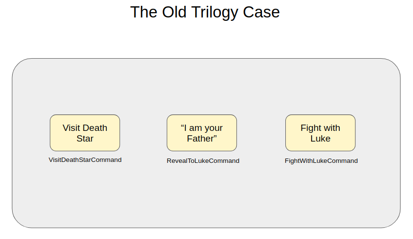

# TJF Process Samples

_Samples_ de utilização dos componentes [__TJF Process Core__][tjf-process-core], [__TJF Process Server__][tjf-process-server-core] e [__TJF Process Service__][tjf-process-service] do [__TOTVS Java Framework__][tjf].

# Contexto

Para exemplificar o uso destes componentes, criaremos uma aplicação que orquestra um processo e outra que responde aos comandos dessa orquestração, __Server__ e __Domain__ respectivamente.

  

<h3 style="color: red">O EXEMPLO UTILIZA A JORNADA DE ANAKYN SKYWALKER   PRINCIPAL PERSONAGEM DA SAGA STAR WARS</h3>

As definições utilizadas nesses exemplos dizem respeito a jornada de Anakin Skywalker da Saga Star Wars. Além do processo em si, inclui também um modelo de decisão e outro de caso de gerenciamento.

Foi escolhido apenas um evento principal de cada episódio da Saga, na sequencia:

1. Anakin é descoberto por Qui Gon Jinn em Tatooine.
2. Anakin se cada com Padmé.
3. Anakin se torna Darth Vader
4. Darth Vader visita a construção da Estrela da Morte.
5. Darth Vader se revela com pai de Luke Skywalker.
6. Darth Vader luta com Luke e morre para salvá-lo do senador Palpatine.

A decisão de se tornar Darth Vader (episódio 3) é realizada por meio de um modelo de decisão (Force Side Decision) que é executado no orquestrador.

Já os eventos da primeira trilogia (episódios 4, 5 e 6) são coordenados no orquestrador por meio de um caso de gerenciamento (The Old Trilogy Case).

  

  

  

# Infraestrutura

Certifique-se que o [__Docker__][docker] e o [__Docker Compose__][docker-compose] estejam corretamente instalados na sua máquina. E caso seja utilizado o exemplo com JavaScript também o [__Node__][node].

Utilizaremos estas ferramentas para montar um ambiente local com todos os componentes de infraestrutura necessários, que de acordo com o exemplo, além do [__RabbitMQ__][rabbit], pode incluir o [__PostgreSQL__][postgres] e o [__TJF Process Service__][tjf-process-service].

# Arquitetura

Estes exemplos partem da premissa que o orquestrador é um micro-serviço distinto ao da aplicação, e que a comunicação entre estes é feita por meio de um _broker_ de mensageria, onde o orquestrador envia comandos para a aplicação e a aplicação responde aos mesmos por meio de eventos.

Caso a orquestração seja muito simples e fique restrita aos serviço da própria aplicação, é possível sim agrupar o orquestrador à aplicação, muito parecido com a implementação do [__tjf-process-server-sample__][tjf-process-server-sample], porém, os _workers_ não mais enviariam mensagens para o _broker_, ficando eles mesmos responsáveis por finalizar as atividades que os executaram.

# Exemplos

Os exemplos são:

[__tjf-process-domain-java-sample__][tjf-process-domain-java-sample]: Aplicação escrita em Java e com o [__TJF Process Core__][tjf-process-core] que responde aos comandos do orquestrador.

[__tjf-process-domain-node-sample__][tjf-process-domain-node-sample]: Aplicação escrita em Javascript que responde aos comandos do orquestrador.

[__tjf-process-server-sample__][tjf-process-server-sample]: Aplicação escrita em Java e com o [__TJF Process Server__][tjf-process-server-core] que orquestra os processos e modelos de nosso exemplo.

[__tjf-process-service-sample__][tjf-process-service-sample]: Aplicação que utiliza o [__TJF Process Service__][tjf-process-service] para orquestrar os processos e modelos de nosso exemplo.

Para rodar o exemplo são necessários uma aplicação do tipo "domain" e uma do tipo "server".

# Que a força esteja com você!

Fique a vontade para explorar os outros recursos propostos pelas bibliotecas de orquestração e enviar sugestões e melhorias para o [__TOTVS Java Framework__][tjf].

[tjf]: https://tjf.totvs.com.br
[tjf-process-core]: https://tjf.totvs.com.br/wiki/tjf-process-core
[tjf-process-server-core]: https://tjf.totvs.com.br/wiki/tjf-process-server-core
[tjf-process-service]: https://tjf.totvs.com.br/wiki/tjf-process-service
[tjf-process-domain-java-sample]: https://github.com/totvs/tjf-samples/tree/master/tjf-process/tjf-process-domain-java-sample
[tjf-process-domain-node-sample]: https://github.com/totvs/tjf-samples/tree/master/tjf-process/tjf-process-domain-node-sample
[tjf-process-server-sample]: https://github.com/totvs/tjf-samples/tree/master/tjf-process/tjf-process-server-sample
[tjf-process-service-sample]: https://github.com/totvs/tjf-samples/tree/master/tjf-process/tjf-process-service-sample
[docker]: https://docs.docker.com/
[docker-compose]: https://docs.docker.com/compose/
[rabbit]: https://www.rabbitmq.com/
[postgres]: https://www.postgresql.org/
[node]: https://nodejs.org/en/