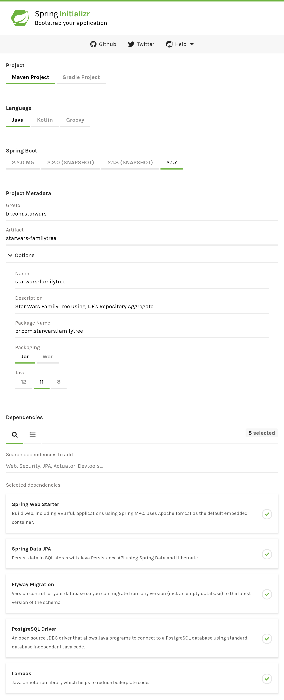

# TJF Repository Aggregate

*Sample* de utilização da biblioteca **TJF Repository Aggregate** do **TOTVS Java Framework**.

## Contexto

Para exemplificar o uso da biblioteca [TJF Repository Aggregate](https://tjf.totvs.com.br/wiki/tjf-repository-aggregate), criaremos algumas *APIs REST* que possibilite a criação de uma árvore geneológica dos personagens do universo **Star Wars**.

Os registros de cada personagem e das árvores geneológicas serão armazenadas em banco de dados em entidades que possuem as informações dos registros agragados no formato `JSON` - removendo assim o *boilerplate* de "de-para" entre a camada de domínio e a camada de infra.

Vamos criar estas entidades de forma que o registro final de uma árvore geneológica fique com a seguinte estrutura:

```json
{
  "id": "412955e5-c530-44d1-89be-87f6c33f370a",
  "person": {
    "id": "b612a670-88a4-47ce-b2a6-85930657d58a",
    "name": "Leia Organa",
    "gender": "female"
  },
  "relatives": [{
    "id": "d433b940-5082-4c67-a59c-7cd8f9163d60",
    "name": "Ben Solo",
    "gender": "male",
    "relationship": "son"
  }]
}
```

> Como engine de banco de dados utilizaremos o [PostgreSQL](https://www.postgresql.org) de forma "dockerizada".

## Começando

Iniciaremos o desenvolvimento criando um novo projeto [Spring](https://spring.io) utilizando o serviço [Spring Initializr](https://start.spring.io). O projeto deve possuir as configurações conforme abaixo:



Precisamos adicionar como dependência os módulos **Spring Web Starter**, **Spring Data JPA**, **PostgreSQL Driver**, **Flyway Migration** e o **Lombok**. Após informados os dados acima e incluídas as dependências necessárias, podemos efetuar a geração do projeto.

## Configurações

Após gerado, precisamos substituir no arquivo `pom.xml` o *parent* do projeto pela biblioteca [TJF Boot Starter](https://tjf.totvs.com.br/wiki/tjf-boot-starter):

```xml
<parent>
  <groupId>com.totvs.tjf</groupId>
  <artifactId>tjf-boot-starter</artifactId>
  <version>1.11.0-RELEASE</version>
  <relativePath />
</parent>
```

Incluiremos também a dependência para utilização da biblioteca **Repository Aggregate** e as configurações do repositório **Maven** com a distribuição do **TOTVS Java Framework**:

**Dependências**

```xml
<dependencies>
  ...

  <!-- TJF -->
  <dependency>
    <groupId>com.totvs.tjf</groupId>
    <artifactId>tjf-repository-aggregate</artifactId>
  </dependency>

</dependencies>
```

**Repositórios**

```xml
<repositories>

  <repository>
    <id>tjf-release</id>
    <name>TOTVS Java Framework: Releases</name>
    <url>http://maven.engpro.totvs.com.br/artifactory/libs-release/</url>
  </repository>

</repositories>
```

Por fim, precisamos renomear o arquivo `application.properties`, da pasta `src/main/resources`, para `application.yml`.

### Banco de dados

As configurações do banco de dados devem ser incluídas no arquivo `application.yml`:

```yml
spring:

  # Configurações banco de dados
  datasource:
    driver-class-name: org.postgresql.Driver
    url: jdbc:postgresql://localhost:5432/swfamilytree
    username: postgres
    password: postgres

  # Configurações JPA
  jpa:
    database-platform: org.hibernate.dialect.PostgreSQL95Dialect
    properties:
      hibernate:
        jdbc:
          lob:
            non_contextual_creation: true
        show_sql: true
        format_sql: true
```

Nas configurações acima, definimos qual *driver* será utilizado para conexão com o banco de dados, o nome do banco (`swfamilytree`), usuário (`postgres`) e senha de acesso.

Precisamos também do *script* de criação da tabela no banco de dados. Este *script* deve ficar na pasta `src/main/resources/db/migration` com o nome `V1.0__initialize.sql` para que seja feita a execução automática pelo [Flyway](https://flywaydb.org).

**V1.0__initialize.sql**

```sql
CREATE TABLE person (
  id VARCHAR(36) NOT NULL,
  data JSONB NOT NULL,
  PRIMARY KEY(id)
);

CREATE TABLE familytree (
  id VARCHAR(36) NOT NULL,
  data JSONB NOT NULL,
  PRIMARY KEY(id)
);
```

> As entidades possuem apenas duas colunas, pois todas as informações de cada registro serão armazenadas na coluna `data` no formato `JSON`.

### Modelos de dados

Agora precisamos criar as classes que representam cada uma das entidades do nosso banco de dados.

As classes destas entidades devem ser anotadas com `@Aggregate` e devem possuir os atributos que a coluna `data` possui (representados pelos atributos da classe).

#### Entidades

Para iniciar, criaremos o pacote `br.com.starwars.familytree.model` e dentro deste pacote criaremos as classes de modelo de dados das tabelas `person` e `familytree` além de outras classes que irão nos auxiliar no desenvolvimento.

**Human.java**

```java
package br.com.starwars.familytree.model;

@Getter
@Setter
@NoArgsConstructor
@AllArgsConstructor
public abstract class Human {

  private String name;
  private String gender;

}
```

**Person.java**

```java
package br.com.starwars.familytree.model;

@Aggregate
@Getter
@Setter
@NoArgsConstructor
@AllArgsConstructor
public class Person extends Human {

  @AggregateIdentifier
  private String id;

}
```

**Relative.java**

```java
package br.com.starwars.familytree.model;

@Getter
@Setter
@NoArgsConstructor
@AllArgsConstructor
public class Relative extends Person {

  private String relationship;

  public Relative(String id, String name, String gender, String relationship) {
    setId(id);
    setName(name);
    setGender(gender);
    setRelationship(relationship);
  }

}
```

**FamilyTree.java**

```java
package br.com.starwars.familytree.model;

@Aggregate
@Getter
@NoArgsConstructor
@AllArgsConstructor
public class FamilyTree {

  @AggregateIdentifier
  private String id;
  private Person person;
  private List<Relative> relatives;

  public FamilyTree(Person person) {
    this(person, new ArrayList<Relative>());
  }

  public FamilyTree(Person person, List<Relative> relatives) {
    this.id = UUID.randomUUID().toString();
    this.person = person;
    this.relatives = relatives;
  }

  public void addRelative(Relative relative) {
    this.relatives.add(relative);
  }

}
```

#### Repositories

Após criadas as classes das entidades, criaremos os **repository** - responsáveis pela criação e leitura dos registros das tabelas `person` e `familytree` no banco de dados - dentro do pacote `br.com.starwars.familytree.repository`.

**PersonRepository.java**

```java
package br.com.starwars.familytree.repository;

@Repository
public class PersonRepository extends CrudAggregateRepository<Person, String> {

  public PersonRepository(EntityManager em, ObjectMapper mapper) {
    super(em, mapper);
  }

}
```

**FamilyTreeRepository.java**

```java
package br.com.starwars.familytree.repository;

@Repository
public class FamilyTreeRepository extends CrudAggregateRepository<FamilyTree, String> {

  public FamilyTreeRepository(EntityManager em, ObjectMapper mapper) {
    super(em, mapper);
  }

}
```

### APIs REST

Vamos agora criar nossas *APIs REST* para manutenção das entidades `person` e `familytree` dentro do pacote `br.com.starwars.familytree.api`.

**PersonController.java**

```java
package br.com.starwars.familytree.api;

@RestController
@RequestMapping(path = "api/v1/person",
  produces = MediaType.APPLICATION_JSON_VALUE, consumes = MediaType.APPLICATION_JSON_VALUE)
public class PersonController {

  @Autowired
  private PersonRepository repository;

  @PostMapping
  public void insert(@RequestBody Person person) {
    repository.insert(person);
  }
  
}
```

**FamilyTreeController.java**

```java
package br.com.starwars.familytree.api;

@RestController
@RequestMapping(path = "api/v1/familytree",
  produces = MediaType.APPLICATION_JSON_VALUE, consumes = MediaType.APPLICATION_JSON_VALUE)
public class FamilyTreeController {

  @Autowired
  private PersonRepository personRepository;

  @Autowired
  private FamilyTreeRepository treeRepository;

  @PostMapping("person/{personId}/relative/{relativeId}/{relationship}")
  public void addPerson(@PathVariable String personId, @PathVariable String relativeId,
      @PathVariable String relationship) {

    FamilyTree fm = treeRepository
        .findOne("data->'person' @> ?", new SqlParameterValue(Types.OTHER, "{\"id\":\"" + personId + "\"}"))
        .orElse(null);

    if (fm == null) {
      Person person = personRepository.get(personId).orElseThrow();
      fm = new FamilyTree(person);
      treeRepository.insert(fm);
    }

    Person relativePerson = personRepository.get(relativeId).orElseThrow();
    Relative relative = new Relative(relativePerson.getId(), relativePerson.getName(), relativePerson.getGender(),
        relationship);
    fm.addRelative(relative);

    treeRepository.update(fm);
  }

  @GetMapping("person/{personId}")
  public FamilyTree getPersonFamilyTree(@PathVariable String personId) {
    return treeRepository
        .findOne("data->'person' @> ?", new SqlParameterValue(Types.OTHER, "{\"id\":\"" + personId + "\"}"))
        .orElse(null);
  }

}
```

### Iniciando o banco de dados

Antes de dar início a execução do nosso projeto, precisamos iniciar o serviço do banco de dados.

Para isto vamos criar um arquivo `docker-compose.yml` para a criação do banco de dados e também da ferramenta de gerenciamento:

**docker-compose.yml**

```yml
version: '3'

services:

  db:
    image: postgres
    restart: always
    environment:
      POSTGRES_PASSWORD: postgres
      POSTGRES_USER: postgres
      POSTGRES_DB: swfamilytree
    ports:
      - 5432:5432
  
  pgadmin:
    image: dpage/pgadmin4
    environment:
      PGADMIN_DEFAULT_EMAIL: sample@test.com
      PGADMIN_DEFAULT_PASSWORD: postgres
    ports:
      - 5480:80
```

Para iniciar os serviços basta executar o comando abaixo na pasta onde foi criado o arquivo:

```bash
docker-compose up -d
```

> O acesso a ferramenta de gerenciamento do banco de dados fica disponível em http://localhost:5480 com o e-mail e senha definidos acima.

### Criação dos registros

Após finalizado o desenvolvimento das *APIs REST* podemos executar nosso projeto, como um **Spring Boot App**, e iniciar a criação dos registros conforme a figura dos personagens abaixo:


* **Anakin Skywalker** e **Padmé Amidala** são pais de **Luke Skywalker** e **Leia Organa**; e
* **Leia Organa** e **Han Solo** são pais de **Ben Solo**.

Vamos iniciar com a criação de cada um destes personagens. Para isto basta efetuar uma requisição *HTTP POST* para cada um deles conforme as informações abaixo:

**Anakin Skywalker**

```http
POST /api/v1/person HTTP/1.1
Host: localhost:8080
Content-Type: application/json

{
  "id": "1d069927-2c3d-4ebd-8678-0ca5d76bae9a",
  "name": "Anakin Skywalker",
  "gender": "male"
}
```

**Padmé Amidala**

```http
POST /api/v1/person HTTP/1.1
Host: localhost:8080
Content-Type: application/json

{
  "id": "b7325afa-8302-4332-8f8a-ddaa063888e2",
  "name": "Padmé Amidala",
  "gender": "female"
}
```

**Luke Skywalker**

```http
POST /api/v1/person HTTP/1.1
Host: localhost:8080
Content-Type: application/json

{
  "id": "82f0a882-a87c-4ad6-881b-8ee30cb3dbe9",
  "name": "Luke Skywalker",
  "gender": "male"
}
```

**Leia Organa**

```http
POST /api/v1/person HTTP/1.1
Host: localhost:8080
Content-Type: application/json

{
  "id": "f64e3a46-7624-4764-991a-f12b536d841f",
  "name": "Leia Organa",
  "gender": "female"
}
```

**Han Solo**

```http
POST /api/v1/person HTTP/1.1
Host: localhost:8080
Content-Type: application/json

{
  "id": "bf10bd9d-31fb-44bc-98f5-0e53615ab1bb",
  "name": "Han Solo",
  "gender": "male"
}
```

**Ben Solo**

```http
POST /api/v1/person HTTP/1.1
Host: localhost:8080
Content-Type: application/json

{
  "id": "320c7cb0-ef2e-4d00-9477-1bb50b16d725",
  "name": "Ben Solo",
  "gender": "male"
}
```

Agora que criamos os personagens, vamos criar o relacionamento entre eles. Como exemplo, vamos nos concentrar apenas na personagem **Padmé Amidala** e a cada requisição adicionar os personagens descendentes dela:

**Luke Skywalker: filho**

```http
POST /api/v1/familytree/person/b7325afa-8302-4332-8f8a-ddaa063888e2/relative/82f0a882-a87c-4ad6-881b-8ee30cb3dbe9/child HTTP/1.1
Host: localhost:8080
Content-Type: application/json
```

**Leia Organa: filha**

```http
POST /api/v1/familytree/person/b7325afa-8302-4332-8f8a-ddaa063888e2/relative/f64e3a46-7624-4764-991a-f12b536d841f/child HTTP/1.1
Host: localhost:8080
Content-Type: application/json
```

**Ben Solo: neto**

```http
POST /api/v1/familytree/person/b7325afa-8302-4332-8f8a-ddaa063888e2/relative/320c7cb0-ef2e-4d00-9477-1bb50b16d725/grandchild HTTP/1.1
Host: localhost:8080
Content-Type: application/json
```

Após realizadas as inclusões acima, podemos recuperar a ávore geneológica da personagem **Padmé Amidala**:

```http
GET /api/v1/familytree/person/b7325afa-8302-4332-8f8a-ddaa063888e2 HTTP/1.1
Host: localhost:8080
Content-Type: application/json
```

**Resultado:**

```json
{
    "id": "2188cde7-da3f-4eea-954b-25a084f54be6",
    "person": {
        "name": "Padmé Amidala",
        "gender": "female",
        "id": "b7325afa-8302-4332-8f8a-ddaa063888e2"
    },
    "relatives": [
        {
            "name": "Luke Skywalker",
            "gender": "male",
            "id": "82f0a882-a87c-4ad6-881b-8ee30cb3dbe9",
            "relationship": "child"
        },
        {
            "name": "Leia Organa",
            "gender": "female",
            "id": "f64e3a46-7624-4764-991a-f12b536d841f",
            "relationship": "child"
        },
        {
            "name": "Ben Solo",
            "gender": "male",
            "id": "320c7cb0-ef2e-4d00-9477-1bb50b16d725",
            "relationship": "grandchild"
        }
    ]
}
```

## Que a força esteja com você!

Com isso terminamos nosso sample, fique a vontade para enriquecê-lo ou evoluí-lo utilizando outros recursos e enviar sugestões e melhorias para o [TOTVS Java Framework](http://tjf.totvs.com.br).