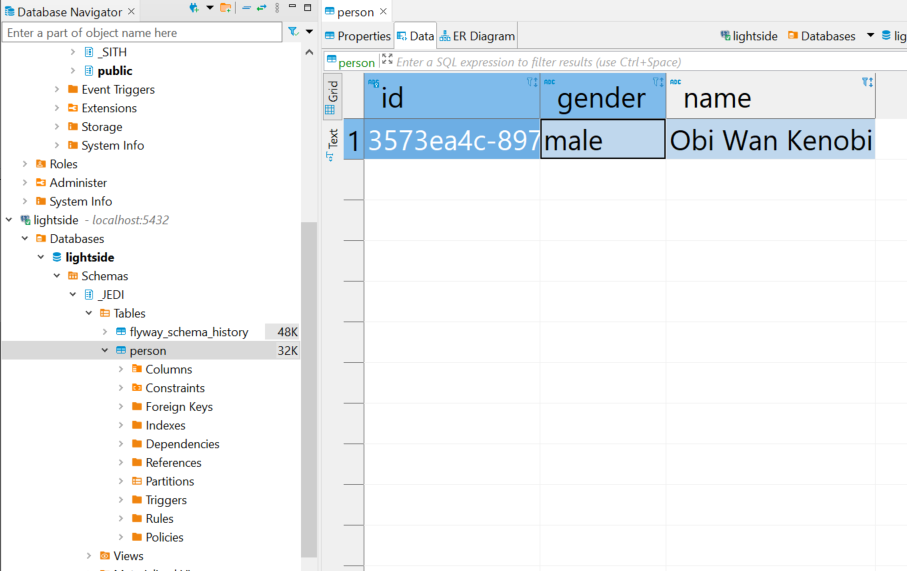

# Exemplo de uso do componente Repository MultiDB

## Contexto

Para exemplificar o uso da biblioteca Repository Multidb, criaremos uma APIs REST que possibilita a criação de uma lista de dados com os personagens de Star Wars.

Os registros de cada personagem serão armazenados em bancos de dados distintos, separados entre aqueles que apoiam o lado negro da força (os Sith e o Império) e os que defendem o equilíbrio da força (os Jedi e a República).

## Começando

Iniciaremos o desenvolvimento criando um novo projeto Spring utilizando o serviço [Spring Initializr](https://start.spring.io). Precisamos adicionar como dependência os módulos **Spring Web Starter**, **PostgreSQL**, **Flyway** e o **Lombok**.

Após informados os dados acima e incluídas as dependências necessárias, podemos efetuar a geração do projeto.

## Configurações

Após gerado, precisamos substituir no arquivo `pom.xml` o _parent_ do projeto pela biblioteca **TJF Boot Starter**:

```xml
<parent>
  <groupId>com.totvs.tjf</groupId>
  <artifactId>tjf-boot-starter</artifactId>
  <version>5.11.0-RELEASE</version>
  <relativePath />
</parent>
```

Incluiremos também a dependência para utilização da biblioteca **Repository MultiDB** e as configurações do repositório Maven com a distribuição do TJF:

**Dependências**

```xml
<dependencies>
  ...

  <!-- TJF -->
  <dependency>
    <groupId>com.totvs.tjf</groupId>
    <artifactId>tjf-repository-multidb</artifactId>
  </dependency>

</dependencies>
```

**Repositórios Maven**

```xml
<repository>
  <id>tjf</id>
  <url>https://totvstfs.pkgs.visualstudio.com/TJF/_packaging/tjf/maven/v1</url>
  <releases>
    <enabled>true</enabled>
  </releases>
  <snapshots>
    <enabled>true</enabled>
  </snapshots>
</repository>
```
⚠️ É preciso configurar o token de acesso da Azure, mais detalhes no [Portal TJF](https://tjf.totvs.com.br/docs/getting-started) .

Por fim, precisamos renomear o arquivo `application.properties`, da pasta `src/main/resources`, para `application.yml`.

### Banco de dados

As configurações do banco de dados devem ser incluídas no arquivo `application.yml`:

```yml
spring:
  # Configurações banco de dados
  datasource:
    url: jdbc:postgresql://localhost:5432/lightside
    username: postgres
    password: postgres
    driver-class-name: org.postgresql.Driver


  # Configurações JPA
  jpa:
    database-platform: org.hibernate.dialect.PostgreSQL95Dialect
    properties:
      hibernate:
        jdbc:
          lob:
            non_contextual_creation: true
tjf:
  tenant:
    
    schema:
      cache:
        loadOnInitialization: true
        validate-on-initialization: true     
      validate-on-initialization: true        
  flyway:  
    migrate: true
 
  datasource:
     darkside:
        tenantIds: 
        - empire
        - sith
        url: jdbc:postgresql://localhost:5433/darkside
        username: postgres
        password: postgres
        driver-class-name: org.postgresql.Driver
        hikari:
          minimum-idle: 5
          maximum-pool-size: 20
          idle-timeout: 100000
          max-lifetime: 450000
```

Nas configurações acima, definimos qual _driver_ será utilizado para conexão com o banco de dados, o nome do banco, usuário e senha de acesso 
para o banco de dados padrão, no tjf.datasource definimos o banco de dados utilziados 
pelos tenantsIds empire e sith.

Precisamos também do _script_ de criação da tabela no banco de dados. Este _script_ deve ficar na pasta `src/main/resources/db/migration` com o nome `V1.0__initialize.sql` para que seja feita a execução automática pelo Flyway:

**V1.0__initialize.sql**

```sql
CREATE TABLE Person (
 id varchar(255),
 gender varchar(255),
 name varchar(255),
 primary key (id)
 );

```

### Modelo de dados

Agora precisamos criar as classes que representam cada uma das entidades do nosso banco de dados.

#### Entidades

Para iniciar criaremos a classe de modelo de dados da tabela `Person`:

**Person.java**

```java
@Getter
@Setter
@AllArgsConstructor
@NoArgsConstructor
@Entity
@Table
public class Person {

	@Id
	@GeneratedValue(strategy = GenerationType.UUID)

	private String id;

	@NotNull
	private String name;

	@NotNull
	private String gender;

}
```

#### Repositories

Após criada a classe da entidade, criaremos os repositórios responsáveis pela criação e leitura dos registros da tabela `Person` no banco de dados:

**PersonRepository.java**

```java
@Repository
public class PersonRepositoryextends JpaRepository<Person, Integer> { {

}
```

### APIs REST

Vamos agora criar nossas APIs REST para manutenção da entidade `Person` :

**RegisterController.java**

```java
@RestController
@RequestMapping(path = "/api/v1/register", produces = MediaType.APPLICATION_JSON_VALUE)
public class RegisterController {

	@Autowired
	private PersonRepository repository;

	@PostMapping
	public Person savePerson(@RequestBody Person dto, @RequestHeader String tenant) {	
		return repository.saveAndFlush(dto);
	}

	@GetMapping
	public List<Person> getAll(@RequestHeader String tenant) {
		return repository.findAll();
	}
	
}
```

## Interceptor

A informação do planeta dos habitantes deve ser informada na _header_ customizada `tenant`. Para que seja possível recuperar e definir esta informação como _tenant_ criaremos um interceptador de requisições:

**TenantInterceptor.java**

```java
public class TenantInterceptor extends HandlerInterceptorAdapter {
	@Override
	public boolean preHandle(HttpServletRequest req, HttpServletResponse res, Object handler) {
		String tenant = req.getHeader("tenant");
		TenantAuthentication.setAuthenticationInfo(tenant);
		return true;
	}
}
```

E no mesmo pacote devemos criar uma classe de configuração para que o interceptador acima possa ser executado:

**TenantConfigurator.java**

```java
@Configuration
public class TenantConfigurator implements WebMvcConfigurer {
  @Override
  public void addInterceptors(InterceptorRegistry registry) {
    registry.addInterceptor(new TenantInterceptor());
  }
}
```

Por fim, criaremos a classe de autenticação que será responsável por definir o _tenant_ atual no contexto da aplicação:

**TenantAuthentication.java**

```java
public class TenantAuthentication {

  public static void setAuthenticationInfo(String tenant) {
    SecurityPrincipal principal = new SecurityPrincipal("92e8a7dc-61d8-4045-9d80-222c774ad791", "admin", tenant,
        tenant);
    UsernamePasswordAuthenticationToken authentication = new UsernamePasswordAuthenticationToken(principal, null);
    SecurityContextHolder.getContext().setAuthentication(authentication);
  }

}
```

### Iniciando o banco de dados

Antes de dar início a execução do projeto precisamos iniciar o serviço do banco de dados. Para isto vamos criar um arquivo `docker-compose.yml` para a criação do banco de dados:

**docker-compose.yml**

```yml
services:
  postgres1:
    image: postgres:15.7
    environment:
      POSTGRES_DB: lightside 
      POSTGRES_USER: postgres 
      POSTGRES_PASSWORD: postgres 
    ports:
      - 5432:5432 
    volumes:
      - postgres1_data:/var/lib/postgresql/data 

  postgres2:
    image: postgres:15.7
    environment:
      POSTGRES_DB: darkside 
      POSTGRES_USER: postgres 
      POSTGRES_PASSWORD: postgres 
    ports:
      - 5433:5432 
    volumes:
      - postgres2_data:/var/lib/postgresql/data 

volumes: 
  postgres1_data: 
  postgres2_data: 

```

Para iniciar os serviços basta executar o comando abaixo na pasta onde foi criado o arquivo:

```command
docker-compose up -d
```


### Criação dos registros

Após finalizado o desenvolvimento das APIs REST podemos executar nosso projeto, como um **Spring Boot App**.

Vamos iniciar com a criação de alguns personagens. Para isto basta efetuar uma requisição _HTTP POST_ para cada personagem 
que deseja conforme as informações abaixo:

**Obi Wan Kenobi**

```http
POST /api/v1/register HTTP/1.1
Host: localhost:8080
Content-Type: application/json
tenant: jedi
{
   "name":"Obi Wan Kenobi",
   "gender": "male" 
}
```

**Leia Organa**

```http
POST /api/v1/register HTTP/1.1
Host: localhost:8080
Content-Type: application/json
tenant: republic
{
  "name": "Leia Organa",
  "gender": "female"
}
```

**Darth Nihilus**

```http
POST /api/v1/register HTTP/1.1
Host: localhost:8080
Content-Type: application/json
tenant: sith
{
   "name":"Darth Nihilus",
   "gender": "male" 
}
```

**Sheev Palpatine**

```http

POST /api/v1/register HTTP/1.1
Host: localhost:8080
Content-Type: application/json
tenant: empire
{
   "name":"Sheev Palpatine",
   "gender": "male" 
}
```


Após realizar as inclusões acima, podemos verificar nos dois bancos de dados como as informações estão divididas:


<p style="text-align: center">
  
</p>

<p style="text-align: center">
  
</p>

Com isso, é possível compartilhar os dados do lado sombrio com as forças do lado luminoso, e vice-versa, sem que nenhum dos lados saiba que possuímos as informações do outro.

## Que a força esteja com você!

Com isso terminamos nosso exemplo, fique a vontade para incrementar o exemplo utilizando todos os recursos proposto pelo componente **Repository MultiDb**, caso necessário utilize nossa [documentação](https://tjf.totvs.com.br/wiki/tjf-repository-multidb) e fique a vontade para mandar sugestões e melhorias para o projeto [TJF](https://tjf.totvs.com.br/).
