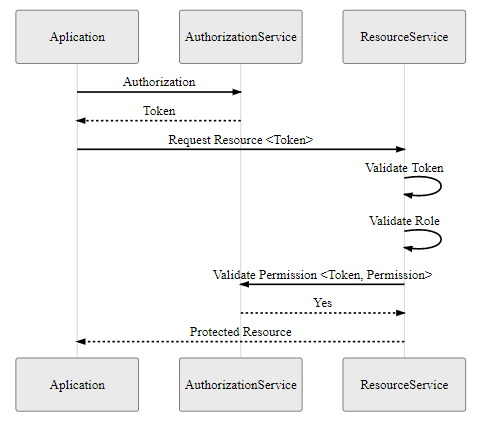

# Exemplo de uso do componente Security Web

## Contexto

Para explicação do componente **Security Web** vamos criar uma API REST para controle de máquinas de uma fábrica e aplicar segurança de autenticação e autorização nos _endpoints_ dessa API.

## Começando com Security Web

Para criação deste exemplo, você vai precisar de um _Authorization Service_ para podermos realizar as validações de segurança, por exemplo o **TOTVS RAC**.

Vamos iniciar a explicação a partir de um projeto Spring já criado, caso você não possua um projeto basta acessar o [Spring initializr](https://start.spring.io/) e criar o projeto. Para fácil entendimento do componente **Security Web** vamos seguir a sequencia abaixo para criação do exemplo.

### Dependências

Primeiramente configure o repositório do TJF em seu `pom.xml`:

```xml
<repositories>

  <repository>
    <id>central-snapshot</id>
    <name>TOTVS Java Framework: Snapshots</name>
    <url>http://maven.engpro.totvs.com.br/artifactory/libs-release</url>
  </repository>

</repositories>
```

Adicione o _parent_ do TJF:

```xml
<parent>
  <groupId>com.totvs.tjf</groupId>
  <artifactId>tjf-boot-starter</artifactId>
  <version>2.6.0-RELEASE</version>
</parent>
```

Para utilização do componente de segurança do TJF é necessário inserir a seguinte dependência em seu arquivo `pom.xml`:

```xml
<dependency>
    <groupId>com.totvs.tjf</groupId>
    <artifactId>tjf-security-web</artifactId>
</dependency>
```

Em nosso exemplo iremos utilizar um serviço web para disponibilizar os endpoints, para isso adicione a seguinte dependência em seu arquivo `pom.xml`:

```xml
<dependency>
    <groupId>org.springframework.boot</groupId>
    <artifactId>spring-boot-starter-web</artifactId>
</dependency>
```

### Configurando integração com o _Authorization Service_

No arquivo `application.yml` precisamos informar nas propriedades na nossa aplicação quais as URI que serão usadas para que nossa aplicação integre com o _Authorization Service_.

```yml
security:
  access:
    api:
      permissions-uri: <O URI para validação das permissions.>
  oauth2:
    resource:
      id: 'authorization_api'
      jwk:
        key-set-uri: <O URI para obter chaves de verificação para validação do token JWT>
```

> **Propriedade opcional**  
> A propriedade `security.access.api.permissions-uri` é necessária apenas se no código for utilizada a anotação `@PreAuthorize` com a função `hasPermission()`.

### Criando o modelo

No nosso exemplo usaremos o enum `Type` que define os tipos de máquinas que teremos em nossa fábrica.

```java
public enum Type {
  COLLECTOR,
  CONVEYOR,
  PRESS;
}
```

A classe `Machine` será o modelo principal da nossa aplicação, nela teremos os métodos para rodar, parar e verificar se está em execução.

```java
public class Machine {

  private boolean running = false;
  private final Type type;

  public Type getType() {
    return type;
  }

  public Machine(Type type) {
    this.type = type;
  }

  public boolean running() {
    return running;
  }

  public void run() {
    this.running = true;
  }

  public void stop() {
    this.running = false;
  }

}
```

### Criando o componente

Para gerenciar nossas máquinas criaremos o componente `MachineManager`, o qual nossos _endpoints_ irão interagir para parar uma máquina, executar determinada máquina ou parar todas as máquinas.
A título de exemplo já instanciaremos a `MachineManager` com 3 máquinas diferentes em seu pool, uma de cada um dos tipo.

```java
@Component
public class MachineManager {

  private List<Machine> machines = new LinkedList<Machine>();

  public MachineManager(){
    machines.add(new Machine(Type.COLLECTOR));
    machines.add(new Machine(Type.CONVEYOR));
    machines.add(new Machine(Type.PRESS));
  }

  public void stop(int id) {
    machines.get(id).stop();
  }

  public void stopAll() {
    for(Machine machine:machines) {
      machine.stop();
    }
  }

  public void run(int id) {
    machines.get(id).run();
  }

  public List<Map<String, Object>> getMachines() {
    List<Map<String, Object>> listMachines = new ArrayList<Map<String, Object>>();
    for(int id = 0; id < machines.size();id++) {
      listMachines.add(getMachine(id));
    }
    return listMachines;
  }

  public HashMap<String, Object> getMachine(int id) {
    Machine machine = machines.get(id);

    HashMap<String, Object> mapMachine = new HashMap<String, Object>();
      mapMachine.put("id", id);
      mapMachine.put("type", machine.getType());
      mapMachine.put("running", machine.running());

    return mapMachine;
  }
}
```

### Criando os _endpoints_

Para iniciarmos o desenvolvimento dos _endpoints_ primeiramente vamos criar o _controller_ que ficará responsável pór receber as requisições e interagir com nosso `MachineManager`.

Nela criaremos três endpoints:

- Um sem validação de autorização, irá verificar apenas a autenticação do usuário. Nela usaremos apenas a anotação `@GetMapping`;
- Um com autorização por _role_ que irá verificar se o usuário tem determinada autorização em determinada _role_. Para isso usaremos além da anotação `@PostMapping` usaremos a anotação `@RolesAllowed`, passando de parâmetro para ela a _role_;
- E por fim dois outros _endpoints_ com autorização por _permission_ que irá verificar se o usuário tem autorização em determinada _permission_. Para isso usaremos alem da anotação `@PostMapping` a anotação `@PreAuthorize`, passando para ela o método `hasPermission` e que receberá qual a _permission_ que queremos validar.

> **Lembrando**: O uso de _permission_ depende da correta configuração da propriedade `security.access.api.permissions-uri` no arquivo de configurações `application.yml`.

```java
@RestController
@RequestMapping(path = "/api/v1/machine", produces = { APPLICATION_JSON_VALUE })
public class MachineController {

  @Autowired
  private MachineManager machineManager;

  @GetMapping
  public List<Map<String, Object>> machineList() {
    return machineManager.getMachines();
  }

  @PostMapping("stop")
  @RolesAllowed("ROLE_SUPERVISOR")
  public List<Map<String, Object>> stopAll() {
    machineManager.stopAll();
    return machineManager.getMachines();
  }

  @PostMapping("{id}/run")
  @PreAuthorize("hasPermission(\"SampleSecurityWeb.machine.run\")")
  public Map<String, Object> run(@PathVariable int id) {
    machineManager.run(id);
    return machineManager.getMachine(id);
  }
}
```

### Fluxo de validação da autorização

Esse é o fluxo para realizar uma requisição usando o `tjf-security-web` que passará por todas as etapas.



## Vamos testar?

Para realizarmos os testes, execute a classe de aplicação do nosso exemplo. Para facilitar nossos testes usaremos o [Postman](https://www.getpostman.com/).

### _endpoint_ com apenas validação de autenticação

Crie uma nova requisição no Postman do tipo _get_ para o _endpoint_ `http://[host]:[porta]/api/v1/machine` e execute a requisição. Como não autenticamos nossa requisição, o retorno deverá ser o seguinte:

```json
{
  "error": "unauthorized",
  "error_description": "Full authentication is required to access this resource"
}
```

Agora vamos autenticar a requisição no Postman:

- Na aba _Authorization_ da requisição que criamos, em _Type_ selecione `Oauth 2.0` e clique em `Get New Acess Token`;
- Informe um nome ao _token_ que será gerado e o tipo como _Authorization Code_.
- Informe os demais campos conforme o _Authorization Service_ no qual você está integrando;
- Clique em `Request Token` e ele irá solicitar o usuário e senha para autenticar no _Authorization Service_;
- Gerado o _token_ clique em `Use Token`.

Agora que estamos autenticados, execute novamente a requisição, deveremos conseguir consultar com sucesso todas as máquinas e o retorno deverá ser conforme abaixo:

```json
[
  {
    "running": false,
    "id": 0,
    "type": "COLLECTOR"
  },
  {
    "running": false,
    "id": 1,
    "type": "CONVEYOR"
  },
  {
    "running": false,
    "id": 2,
    "type": "PRESS"
  }
]
```

### _endpoint_ com validação de autorização por _permission_

Agora vamos fazer um teste do _endpoint_ com a validação de autorização por _permission_.

Crie uma nova requisição no Postman do tipo _post_ para o endpoint `http://[host]:[porta]/api/v1/machine/{id da máquina}/run` e clique em `Send` para executar a requisição. Como não autenticamos a requição, o retorno deverá ser o seguinte:

```json
{
  "error": "unauthorized",
  "error_description": "Full authentication is required to access this resource"
}
```

Autentique a requisição conforme anteriormente, mas use um usuário, que no _Authorization Service_ no qual você está integrando, não tenha autorização para a _permission_ `SampleSecurityWeb.machine.run`.

> Talvez você precisará antes excluir os _cookies_ no Postman para que ele não use o mesmo usuário já informado.

Execute a requisição, o retorno será conforme abaixo, mostrando que estamos autenticado, mas o usuário não tem permissão:

```json
{
  "error": "access_denied",
  "error_description": "Access denied"
}
```

Agora autentique a requisição gerando um novo _token_, mas agora com um usuário que tem autorização para a _permission_ `SampleSecurityWeb.machine.run`, que foi a _permission_ que definimos para o nosso _endpoint_.

Vamos executar novamente a requisição, você deve conseguir iniciar a máquina com sucesso e o retorno deverá ser como este:

```json
{
  "running": true,
  "id": "<id da máquina>",
  "type": "<tipo da máquina>"
}
```

### _endpoint_ com validação de autorização por _role_

Agora vamos fazer um teste do _endpoint_ com a validação de autorização por _role_.

Crie uma nova requisição no Postman do tipo _post_ para o endpoint `http://[host]:[porta]/api/v1/machine/stop` e clique em `Send` para executar a requisição.

Como não autenticamos a requisição, o retorno deverá ser o seguinte:

```json
{
  "error": "unauthorized",
  "error_description": "Full authentication is required to access this resource"
}
```

Autentique a requisição conforme visto anteriormente, mas use um usuário que, no _Authorization Service_ no qual você está integrando, não tem autorização para a _role_ `SUPERVISOR`.

> Talvez você precisará antes excluir os _cookies_ no Postman para que ele não use o mesmo usuário já informado anteriormente.

Execute a requisição, o retorno será conforme abaixo, mostrando que estamos autenticado, mas o usuário não tem permissão:

```json
{
  "error": "access_denied",
  "error_description": "Access denied"
}
```

Agora autentique a requisição gerando um novo _token_, mas agora com um usuário que tem autorização para a _role_ `SUPERVISOR`, que foi a _role_ que definimos para o nosso _endpoint_.

Vamos executar novamente a requisição, você deve conseguir parar todas máquinas com sucesso e o retorno deverá ser como este:

```json
[
  {
    "running": false,
    "id": 0,
    "type": "COLLECTOR"
  },
  {
    "running": false,
    "id": 1,
    "type": "CONVEYOR"
  },
  {
    "running": false,
    "id": 2,
    "type": "PRESS"
  }
]
```

> :warning: **Importante:** Os retornos de erros seguirão o padrão do [API Core](https://tjf.totvs.com.br/wiki/tjf-api-core) caso você o use nos _endpoints_ do seu projeto.

## Que a força esteja com você!

Com isso terminamos nosso exemplo, fique a vontade para incrementar o exemplo utilizando todos os recursos proposto pelo componente **Security Web**, caso necessário utilize nossa [documentação](https://tjf.totvs.com.br/wiki/tjf-security-web) e fique a vontade para mandar sugestões e melhorias para o projeto [TJF](https://tjf.totvs.com.br/).
