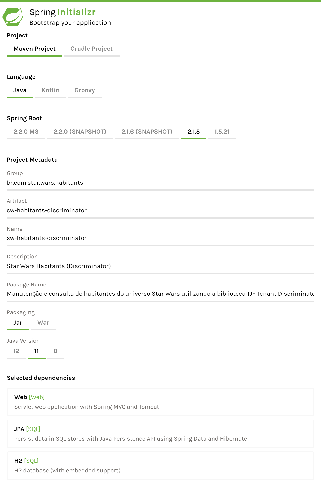
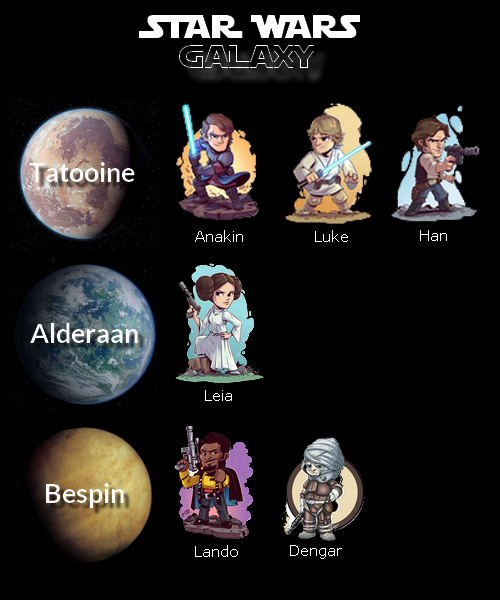

# Tenant Discriminator Sample

_Sample_ de utilização da biblioteca [__Tenant Discriminator__][tjf-tenant-discriminator] do [__TOTVS Java Framework__][tjf].

## Contexto

Para exemplificar o uso da biblioteca [__Tenant Discriminator__][tjf-tenant-discriminator], criaremos uma _API REST_ que possibilite a manutenção e leitura dos habitantes do universo __Star Wars__ de forma que estes sejam criados dentro de sesus respectivos planetas, que servirão como nossos _tenants_.

Os registros destes habitantes serão armazenados em banco de dados e a informação do planeta de cada habitante será gravada na coluna __tenant_id__ de cada registro.

> Como _engine_ de banco de dados utilizaremos o [H2][h2].


# Começando

Iniciaremos o desenvolvimento criando um novo projeto [Spring][spring] utilizando o serviço [Spring Initializr][spring-initializr]. O projeto deve possuir as configurações conforme abaixo:

<p align="center">
  
</p>

Precisamos também adicionar como dependência os módulos __Web__, __JPA__ e __H2__. Após informados os dados e incluídas as dependências necessárias, podemos iniciar a geração do projeto.


## Configurações

Após gerado, precisamos substituir no arquivo `pom.xml` o _parent_ do projeto pela biblioteca [__TJF Boot Starter__][tjf-boot-starter]:

```xml
<parent>
  <groupId>com.totvs.tjf</groupId>
  <artifactId>tjf-boot-starter</artifactId>
  <version>0.2.0-RELEASE</version>
</parent>
```

Incluiremos também a dependência para utilização da biblioteca [__Tenant Discriminator__][tjf-tenant-discriminator] e as configurações do repositório __Maven__ com a distribuição do __TOTVS Java Framework__:

_Dependências_

```xml
<dependencies>
  ...

  <!-- TJF -->
  <dependency>
    <groupId>com.totvs.tjf</groupId>
    <artifactId>tjf-tenant-discriminator</artifactId>
  </dependency>

</dependencies>
```

_Repositórios_

```xml
<repositories>

  <repository>
    <id>tjf-release</id>
    <name>TOTVS Java Framework: Releases</name>
    <url>http://maven.engpro.totvs.com.br/artifactory/libs-release/</url>
  </repository>

</repositories>
```

Por fim, precisamos renomear o arquivo `application.properties`, da pasta `src/main/resources`, para `application.yml`.


### Banco de dados

As configurações do banco de dados devem ser incluídas no arquivo `application.yml`:

```yaml
spring:

  # Configurações H2
  h2:
    console:
      enabled: true
      path: /h2

  # Configurações banco de dados
  datasource:
    driver-class-name: org.h2.Driver
    url: jdbc:h2:file:C:/tmp/starwarsdb
    username: sa

  # Configurações JPA
  jpa:
    database-platform: org.hibernate.dialect.H2Dialect
    hibernate:
      ddl-auto: update
    properties:
      hibernate:
        session_factory:
          statement_inspector: com.totvs.tjf.tenant.discriminator.SQLInspector
```

Nas configurações acima, definimos qual _driver_ será utilizado para conexão com o banco de dados, o nome do banco (`starwarsdb`) e usuário de acesso (`sa`). Na configuração JPA foi definido, a partir da propriedade `spring.jpa.hibernate.dll-auto`, que a criação e atualização das tabelas do banco de dados será realizada de forma automática (`update`) pelo próprio [Hibernate][hibernate].

> A propriedade `spring.jpa.properties.hibernate.session_factory.statement_inspector` com o valor `com.totvs.tjf.tenant.discriminator.SQLInspector` é necessária para que a biblioteca [__Tenant Discriminator__][tjf-tenant-discriminator] possa interceptar as consultas no banco de dados e incluir como filtro o valor do _tenant_ atual do contexto.


## Modelo de dados

Para que seja possível a criação automática das tabelas pelo [Hibernate][hibernate] precisamos criar classes que representam cada uma das entidades do nosso banco de dados. As classes de entidade devem ser anotadas com `@Entity` e devem possuir as colunas que a entidade possui (representadas pelos atributos da classe).


### Entidades

Para iniciar, criaremos o pacote `br.com.star.wars.habitants.model`, para agrupar todas as classes relacionadas ao nosso modelo de dados, e dentro dele criaremos a classe de entidade que representa a tabela `habitant`, onde ficarão armazenadas as informações dos habitantes:

_HabitantModel.java_

```java
@Entity
@Table(name = "habitant")
public class HabitantModel {

  @EmbeddedId
  private HabitantModelId id;

  @NotNull
  private String name;

  @NotNull
  private String gender;

  public HabitantModelId getId() {
    return this.id;
  }

  public void setId(HabitantModelId id) {
    this.id = id;
  }

  public String getName() {
    return this.name;
  }

  public void setName(String name) {
    this.name = name;
  }

  public String getGender() {
    return this.gender;
  }

  public void setGender(String gender) {
    this.gender = gender;
  }

}
```

Observando a entidade desenvolvida acima, cada habitante terá sua identificação, nome e gênero. A informação de identificação, diferente dos demais atributos, não possui um tipo primitivo, mas sim uma instância da classe `HabitantModelId`.

Isto porque de acordo com a documentação da biblioteca [__Tenant Discriminator__][tjf-tenant-discriminator], a informação do _tenant_ deve ser representada por uma coluna chamada __tenant_id__ e a mesma deve constar como chave primária da tabela, ou seja, a tabela `habitant` precisa  de uma chave primária composta por duas colunas: __tenant_id__ e __id__. Sendo __tenant_id__ o _tenant_ do registro e identificação do planeta e __id__ a identificação do habitante.

Criaremos então a classe `HabitantModelId` de representação desta chave primária. Ela deve estender a classe [`TenantId`][tenantid] para que a criação da coluna __tenant_id__ e a definição de seu valor seja realizada corretamente:

_HabitantModelId.java_

```java
@Embeddable
public class HabitantModelId extends TenantId {

  private static final long serialVersionUID = 4010942799108332905L;

  @NotNull
  private String id;

  public HabitantModelId() {}

  public HabitantModelId(String id) {
    this.setId(id);
  }

  public String getId() {
    return this.id;
  }

  public void setId(String id) {
    this.id = id;
  }

}
```


### Repository

Após criadas as classes de entidade, criaremos nosso _repository_ responsável pela criação e leitura dos registros da tabela `habitant` no banco de dados:

_HabitantModelRepository.java_

```java
package br.com.star.wars.habitants.model;

public interface HabitantModelRepository extends JpaRepository<HabitantModel, HabitantModelId> {}
```


# API REST

## DTOs

Antes de iniciar a criação da nossa _API REST_, precisamos criar as classes de [_Data Transfer Object (DTO)_][dto]. Estas classes possibilitam a conversão dos dados recebidos na execução da _API REST_ (geralmente uma estrutura no formato `JSON`) para o formato definido em nosso modelo de dados.

Criaremos o pacote `br.com.star.wars.habitants.dto` para agrupar estas classes de transferência de dados e dentro dele criaremos a classe [_DTO_][dto] que representará as informações de registro da tabela `habitant`:

_HabitantDto.java_

```java
public class HabitantDto {

  private String id;
  private String name;
  private String gender;

  public String getId() {
    return this.id;
  }

  public void setId(String id) {
    this.id = id;
  }

  public String getName() {
    return this.name;
  }

  public void setName(String name) {
    this.name = name;
  }

  public String getGender() {
    return this.gender;
  }

  public void setGender(String gender) {
    this.gender = gender;
  }

}
```


## Controllers

Para a criação da _API REST_ de manutenção e leitura dos habitantes, criaremos uma nova classe, anotada com `@RestController`, com dois métodos principais: um para criação e outro para leitura dos registros dos habitantes. Ambas as ações devem ser realizadas utilizando o repositório `HabitantModelRepository`.

Para agrupar as _APIs REST_, criaremos o pacote `br.com.star.wars.habitants.api` e dentro dele criaremos nossa _API_:

_HabitantController.java_

```java
@RestController
@RequestMapping(path = "/api/v1/habitants", produces = MediaType.APPLICATION_JSON_VALUE)
public class HabitantController {

  @Autowired
  private HabitantModelRepository repository;

  @PostMapping
  public HabitantModel save(@RequestHeader("X-Tenant") String tenant, @RequestBody HabitantDto dto) {
    // Define o tenant atual do contexto conforme recebido.
    StarWarsHabitantsAuthentication.setAuthenticationInfo(tenant);

    // Efetua a conversão do objeto recebido para o objeto de modelo.
    HabitantModel habitant = new HabitantModel();
    habitant.setId(new HabitantModelId(dto.getId()));
    habitant.setName(dto.getName());
    habitant.setGender(dto.getGender());

    return repository.save(habitant);
  }

  @GetMapping
  public List<HabitantModel> get(@RequestHeader("X-Tenant") String tenant) {
    // Define o tenant atual do contexto conforme recebido.
    StarWarsHabitantsAuthentication.setAuthenticationInfo(tenant);
    return repository.findAll();
  }

}
```

Analisando a classe acima é possível observar que o método de criação de um novo habitante (`save`) recebe os dados do mesmo no corpo da requisição. Estes dados devem seguir a estrutura `JSON` abaixo:

```json
{
  "id": "luke",
  "name": "Luke Skywalker",
  "gender": "male"
}
```

Já a informação do planeta deve ser informada na _header_ customizada `X-Tenant` e deve ser definida como _tenant_ atual do contexto. Para isto criaremos a classe de autenticação dentro do pacote principal `br.com.star.wars`:

```java
public class StarWarsHabitantsAuthentication {

  public static void setAuthenticationInfo(String tenant) {
    // A classe SecurityPrincipal recebe três parâmetros:
    // 1 - Código do usuário, exemplo: admin
    // 2 - Código do tenant, exemplo: 92e8a7dc-61d8-4045-9d80-222c774ad790
    // 3 - Código do tenant que será salvo no banco de dados, exemplo: 92e8a7dc
    SecurityPrincipal principal = new SecurityPrincipal("admin", tenant, tenant);
    UsernamePasswordAuthenticationToken authentication = new UsernamePasswordAuthenticationToken(principal, "");
    SecurityContextHolder.getContext().setAuthentication(authentication);
  }

}
```

### Criação dos registros

Após finalizado o desenvolvimento da _API REST_ podemos executar nosso projeto, como um _Spring Boot App_, e iniciar a criação dos registros conforme a figura dos habitantes e planetas abaixo:

<p align="center">
  
</p>

* Os habitantes __Anakin__, __Luke__ e __Han__ vivem no planeta __Tatooine__;
* A habitante __Leia__ vive no planea __Alderaan__; e
* Os habitantes __Lando__ e __Dengar__ vivem no planeta __Bespin__.

Para efetuar a criação, basta executar requisições _HTTP POST_ para cada habitante com as informações de cada um deles, conforme o exemplo abaixo:

```http
POST /api/v1/habitants HTTP/1.1
Host: localhost:8080
Content-Type: application/json
X-Tenant: Tatooine

{
    "id": "luke",
    "name": "Luke Skywalker",
    "gender": "male"
}
```


# Que a força esteja com você!

Com isso terminamos nosso _sample_, fique a vontade para enriquecê-lo utilizando outros recursos propostos pela biblioteca [__Tenant Discriminator__][tjf-tenant-discriminator] e enviar sugestões e melhorias para o [__TOTVS Java Framework__][tjf].

[tjf]: https://tjf.totvs.com.br
[h2]: https://www.h2database.com
[tjf-tenant-discriminator]: https://tjf.totvs.com.br/framework/tjf-tenant-discriminator
[spring]: https://spring.io
[spring-initializr]: https://start.spring.io
[tjf-boot-starter]: https://tjf.totvs.com.br/framework/tjf-boot-starter
[github]: https://github.com/totvs/tjf-samples
[hibernate]: https://hibernate.org
[tenantid]: https://tjf.totvs.com.br/framework/tjf-tenant-discriminator#tenantid
[dto]: https://pt.stackoverflow.com/questions/31362/o-que-é-um-dto
[postman]: https://www.getpostman.com