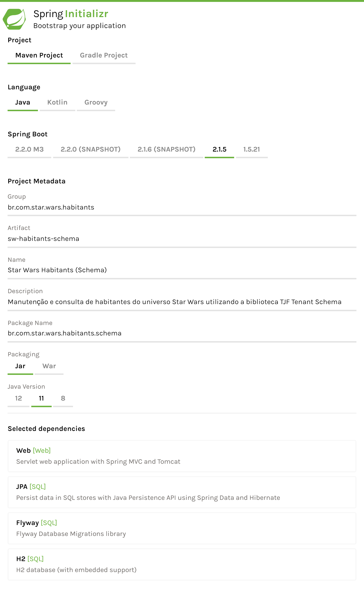

# Tenant Schema Sample

_Sample_ de utilização da biblioteca [__Tenant Schema__][tjf-tenant-schema] do [__TOTVS Java Framework__][tjf].


## Contexto

Para exemplificar o uso da biblioteca [__Tenant Schema__][tjf-tenant-schema], criaremos uma _API REST_ que possibilite a manutenção e leitura dos habitantes do universo __Star Wars__ de forma que estes sejam criados dentro de seus respectivos planetas, que servirão como nossos _tenants_.

Os registros destes habitantes serão armazenados em banco de dados e cada _schema_ criado no banco de dados representará o planeta de cada habitante.

> Como _engine_ de banco de dados utilizaremos o [H2][h2].


# Começando

Iniciaremos o desenvolvimento criando um novo projeto [Spring][spring] utilizando o serviço [Spring Initializr][spring-initializr]. O projeto deve possuir as configurações conforme abaixo:

<p align="center">
  
</p>

Precisamos também adicionar como dependência os módulos __Web__, __JPA__, __Flyway__ e __H2__. Após informados os dados e incluídas as dependências necessárias, podemos iniciar a geração do projeto.


## Configurações

Após gerado, precisamos substituir no arquivo `pom.xml` o _parent_ do projeto pela biblioteca [__TJF Boot Starter__][tjf-boot-starter]:

```xml
<parent>
  <groupId>com.totvs.tjf</groupId>
  <artifactId>tjf-boot-starter</artifactId>
  <version>1.11.0-RELEASE</version>
</parent>
```

Incluiremos também a dependência para utilização da biblioteca [__Tenant Schema__][tjf-tenant-schema] e as configurações do repositório __Maven__ com a distribuição do [__TOTVS Java Framework__][tjf]:

_Dependências_

```xml
<dependencies>
  ...

  <!-- TJF -->
  <dependency>
    <groupId>com.totvs.tjf</groupId>
    <artifactId>tjf-tenant-schema</artifactId>
  </dependency>

</dependencies>
```

_Repositórios_

```xml
<repositories>

  <repository>
    <id>tjf-release</id>
    <name>TOTVS Java Framework: Releases</name>
    <url>http://maven.engpro.totvs.com.br/artifactory/libs-release/</url>
  </repository>

</repositories>
```

Por fim, precisamos renomear o arquivo `application.properties`, da pasta `src/main/resources`, para `application.yml`.


### Banco de dados

As configurações do banco de dados devem ser incluídas no arquivo `application.yml`:

```yaml
spring:

  flyway:
    enabled: true

  # Configurações H2
  h2:
    console:
      enabled: true
      path: /h2

  # Configurações banco de dados
  datasource:
    driver-class-name: org.h2.Driver
    url: jdbc:h2:file:C:/tmp/starwarsdb
    username: sa

  # Configurações JPA
  jpa:
    database-platform: org.hibernate.dialect.H2Dialect
```

Nas configurações acima, definimos qual _driver_ será utilizado para conexão com o banco de dados, o nome do banco (`starwarsdb`) e usuário de acesso (`sa`).

Precisamos também dos _scripts_ de criação dos _schemas_ e tabelas no banco de dados. Estes _scripts_ devem ficar na pasta `src/main/resources/db/migration` com o nome `V1.0__initialize.sql` para que seja feita a execução automática pelo [__Flyway__][flyway]:

_V1.0__initialize.sql_

```sql
-- TATOOINE
CREATE SCHEMA _TATOOINE;
SET SCHEMA _TATOOINE;

CREATE TABLE habitant (
  id VARCHAR(36) NOT NULL,
  name VARCHAR(255) NOT NULL,
  gender VARCHAR(06) NOT NULL,
  PRIMARY KEY (id));

-- ALDERAAN
CREATE SCHEMA _ALDERAAN;
SET SCHEMA _ALDERAAN;

CREATE TABLE habitant (
  id VARCHAR(36) NOT NULL,
  name VARCHAR(255) NOT NULL,
  gender VARCHAR(06) NOT NULL,
  PRIMARY KEY (id));

-- BESPIN
CREATE SCHEMA _BESPIN;
SET SCHEMA _BESPIN;

CREATE TABLE habitant (
  id VARCHAR(36) NOT NULL,
  name VARCHAR(255) NOT NULL,
  gender VARCHAR(06) NOT NULL,
  PRIMARY KEY (id));
```


## Modelo de dados

Após o desenvolvimento dos _scripts_ de criação das tabelas, precisamos criar as classes que representam cada uma das entidades do nosso banco de dados. As classes de entidade devem ser anotadas com `@Entity` e devem possuir as colunas que a entidade possui (representadas pelos atributos da classe).


### Entidades

Para iniciar, criaremos o pacote `br.com.star.wars.habitants.model`, para agrupar todas as classes relacionadas ao nosso modelo de dados, e dentro dele criaremos a classe de entidade que representa a tabela `habitant`, onde ficarão armazenadas as informações dos habitantes:

_HabitantModel.java_

```java
@Entity
@Table(name = "habitant")
public class HabitantModel {

  @Id
  private String id;

  @NotNull
  private String name;

  @NotNull
  private String gender;

  public String getId() {
    return this.id;
  }

  public void setId(String id) {
    this.id = id;
  }

  public String getName() {
    return this.name;
  }

  public void setName(String name) {
    this.name = name;
  }

  public String getGender() {
    return this.gender;
  }

  public void setGender(String gender) {
    this.gender = gender;
  }

}
```

Observando a entidade desenvolvida acima, cada habitante terá sua identificação, nome e gênero.


### Repository

Após criadas as classes de entidade, criaremos nosso _repository_ responsável pela criação e leitura dos registros da tabela `habitant` no banco de dados:

_HabitantModelRepository.java_

```java
package br.com.star.wars.habitants.model;

public interface HabitantModelRepository extends JpaRepository<HabitantModel, String> {}
```


# API REST

## DTOs

Antes de iniciar a criação da nossa _API REST_, precisamos criar as classes de [_Data Transfer Object (DTO)_][dto]. Estas classes possibilitam a conversão dos dados recebidos na execução da _API REST_ (geralmente uma estrutura no formato `JSON`) para o formato definido em nosso modelo de dados.

Criaremos o pacote `br.com.star.wars.habitants.dto` para agrupar estas classes de transferência de dados e dentro dele criaremos a classe [_DTO_][dto] que representará as informações de registro da tabela `habitant`:

_HabitantDto.java_

```java
public class HabitantDto {

  private String id;
  private String name;
  private String gender;

  public String getId() {
    return this.id;
  }

  public void setId(String id) {
    this.id = id;
  }

  public String getName() {
    return this.name;
  }

  public void setName(String name) {
    this.name = name;
  }

  public String getGender() {
    return this.gender;
  }

  public void setGender(String gender) {
    this.gender = gender;
  }

}
```


## Controllers

Para a criação da _API REST_ vamos desenvolver uma nova classe, anotada com `@RestController`, com dois métodos principais: um para criação e outro para leitura dos habitantes. Ambas as ações devem ser realizadas utilizando o repositório `HabitantModelRepository`.

Para agrupar as _APIs REST_, criaremos o pacote `br.com.star.wars.habitants.api` e dentro dele nossa _API_, que poderá ser executada a partir da URL `/api/v1/habitants`:

_HabitantController.java_

```java
@RestController
@RequestMapping(path = "/api/v1/habitants", produces = MediaType.APPLICATION_JSON_VALUE)
public class HabitantController {

  @Autowired
  private HabitantModelRepository repository;

  @PostMapping
  public List<HabitantModel> saveAll(@RequestBody List<HabitantDto> dtos) {
    List<HabitantModel> habitants = new ArrayList<HabitantModel>();

    for (HabitantDto dto : dtos) {
      // Efetua a conversão do objeto recebido para o objeto de modelo.
      HabitantModel habitant = new HabitantModel();
      habitant.setId(dto.getId());
      habitant.setName(dto.getName());
      habitant.setGender(dto.getGender());

      habitants.add(habitant);
    }

    return repository.saveAll(habitants);
  }

  @GetMapping
  public List<HabitantModel> getAll() {
    return repository.findAll();
  }

}
```

Analisando a classe acima é possível observar que o método de criação de habitante (`save`) recebe os dados do mesmo no corpo da requisição. Estes dados devem seguir a estrutura `JSON` abaixo:

```json
[{
  "id": "luke",
  "name": "Luke Skywalker",
  "gender": "male"
}]
```

Porém precisamos ainda definir qual o planeta (_tenant_) do habitante que está sendo criado ou lido.


## Interceptor

A informação do planeta (_tenant_) dos habitantes deve ser informada na _header_ customizada `X-Planet`. Para que seja possível recuperar e definir esta informação como _tenant_ criaremos um interceptador de requisições dentro do pacote principal do projeto `br.com.star.wars.habitants`:

_StarWarsHabitantsInterceptor.java_

```java
public class StarWarsHabitantsInterceptor extends HandlerInterceptorAdapter {
  @Override
  public boolean preHandle(HttpServletRequest req, HttpServletResponse res, Object handler) {
    String tenant = req.getHeader("X-Planet");
    StarWarsHabitantsAuthentication.setAuthenticationInfo(tenant);
    return true;
  }
}
```

E no mesmo pacote devemos criar uma classe de configuração para que o interceptador acima possa ser executado:

_StarWarsHabitantsConfigurator.java_

```java
@Configuration
public class StarWarsHabitantsConfigurator implements WebMvcConfigurer {
  @Override
  public void addInterceptors(InterceptorRegistry registry) {
    registry.addInterceptor(new StarWarsHabitantsInterceptor());
  }
}
```

Por fim, criaremos a classe de autenticação que será responsável por definir o _tenant_ atual no contexto da aplicação:

_StarWarsHabitantsAuthentication.java_

```java
public class StarWarsHabitantsAuthentication {

  public static void setAuthenticationInfo(String tenant) {
    // A classe SecurityPrincipal recebe três parâmetros:
    // 1 - Código do usuário, exemplo: admin
    // 2 - Código do tenant, exemplo: 92e8a7dc-61d8-4045-9d80-222c774ad790
    // 3 - Código do tenant que será salvo no banco de dados, exemplo: 92e8a7dc
    SecurityPrincipal principal = new SecurityPrincipal("admin", tenant, tenant);
    UsernamePasswordAuthenticationToken authentication = new UsernamePasswordAuthenticationToken(principal, "");
    SecurityContextHolder.getContext().setAuthentication(authentication);
  }

}
```

> Em uma aplicação real, a informação do _tenant_ geralmente é informada no _token_ de autenticação.

### Criação dos registros

Após finalizado o desenvolvimento da _API REST_ podemos executar nosso projeto, como um _Spring Boot App_, e iniciar a criação dos registros conforme a figura dos habitantes e planetas abaixo:

<p align="center">
  
</p>

* Os habitantes __Anakin__, __Luke__ e __Han__ vivem no planeta __Tatooine__;
* A habitante __Leia__ vive no planea __Alderaan__; e
* Os habitantes __Lando__ e __Dengar__ vivem no planeta __Bespin__.

Para efetuar a criação, basta executar requisições _HTTP POST_ para cada habitante com as informações de cada um deles, conforme o exemplo abaixo:

_Tatooine_

```http
POST /api/v1/habitants HTTP/1.1
Host: localhost:8080
Content-Type: application/json
X-Planet: Tatooine

[{
  "id": "anakin",
  "name": "Anakin Skywalker",
  "gender": "male"
},{
  "id": "luke",
  "name": "Luke Skywalker",
  "gender": "male"
},{
  "id": "han",
  "name": "Han Solo",
  "gender": "male"
}]
```

_Alderaan_

```http
POST /api/v1/habitants HTTP/1.1
Host: localhost:8080
Content-Type: application/json
X-Planet: Alderaan

[{
  "id": "leia",
  "name": "Leia Organa",
  "gender": "female"
}]
```

_Bespin_

```http
POST /api/v1/habitants HTTP/1.1
Host: localhost:8080
Content-Type: application/json
X-Planet: Bespin

[{
  "id": "lando",
  "name": "Lando Calrissian",
  "gender": "male"
},{
  "id": "dengar",
  "name": "Dengar, The Bounty Hunter",
  "gender": "male"
}]
```

> É importante que cada requisição possua a _header_ `X-Planet` com o nome do planeta de cada habitante que está sendo criado.


## Leitura dos registros

Para efetuar a leitura dos habitantes, basta informar na _header_ `X-Planet` o nome do planeta, exemplo:

```http
GET /api/v1/habitants HTTP/1.1
Host: localhost:8080
Content-Type: application/json
X-Planet: Bespin
```

É possível conferir os dados no banco de dados acessando a URL `http://localhost:8080/h2` e informar os mesmos dados de conexão que foram informados no arquivo `application.yaml`:

<p align="center">
  
<p>


# Que a força esteja com você!

Com isso terminamos nosso _sample_, fique a vontade para enriquecê-lo utilizando outros recursos propostos pela biblioteca [__Tenant Schema__][tjf-tenant-schema] e enviar sugestões e melhorias para o [__TOTVS Java Framework__][tjf].

[tjf-tenant-schema]: https://tjf.totvs.com.br/wiki/tjf-tenant-schema
[tjf]: https://tjf.totvs.com.br
[h2]: https://www.h2database.com
[spring]: https://spring.io
[spring-initializr]: https://start.spring.io
[tjf-boot-starter]: https://tjf.totvs.com.br/wiki/tjf-boot-starter
[flyway]: https://flywaydb.org
[dto]: https://pt.stackoverflow.com/questions/31362/o-que-é-um-dto